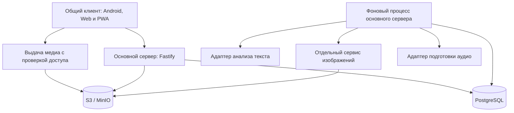

# Архитектура Kompotik

Статус: согласованное направление архитектуры с открытыми деталями; не описание уже реализованного приложения.
Дата: 25 сентября 2026 года. Версия: 0.5.

Детализация для обсуждения вынесена в отдельные документы (новые предложения в них не являются автоматически утверждёнными требованиями):

- [Пользовательский интерфейс: экраны, сценарии и простые схемы](user-interface.md).
- [API основного сервера: методы и передаваемые данные](api.md).
- [База данных: таблицы, поля, связи и ограничения](database.md).
- [ER-диаграмма базы данных](database-er.md).
- [Взаимодействие с анализатором текста, генератором изображений и озвучкой](service-interfaces.md).

## 1. Основания и границы документа

Источники:

- [Функциональные требования](https://docs.google.com/document/d/13DhyOBaIGAJRgvpVTTC32wxpCtCYCFFowQn9RIn3KDU/edit).
- [Нефункциональные требования](https://docs.google.com/document/d/1c5UXA0RfIJ75Z2sQTfz0E-spPfpsIqhiP_baDNj83vI/edit).
- Ответы владельца проекта на вопросы 1–10 от 23 сентября 2026 года. При расхождении они имеют приоритет над документами.

Уточнения владельца от 24 сентября 2026 года имеют приоритет: общий клиент, PWA и браузерный офлайн, языковые корни, конечное число повторений и отсутствие серверных учебных сессий. Остальные предложения версии 0.1 одобрены владельцем. Сохранившееся слово «предложение» обозначает принятое направление реализации, а не повторный запрос подтверждения. Конкретные значения и отсутствующие продуктовые правила не считаются автоматически согласованными; они перечислены в разделе 15. Схемы данных, API и каталоги концептуальные.

Цель — приложение для автора и друзей, с возможностью последующего публичного доступа. Предлагается простой сервер с бизнес-модулями и отдельными процессами тяжёлой обработки. Масштабирование до большой аудитории не является исходным требованием.

## 2. Принятые требования

| Область | Решение |
| --- | --- |
| Клиенты | Общий клиент: Android, веб для телефона и ПК, PWA с офлайн-обучением. iOS предусмотрен в будущем; расширение браузера вне объёма. |
| Языки обучения | Английский → русский и французский → русский. Новые языки добавляются после подготовки контента. |
| Языки интерфейса | Русский, английский и французский; язык интерфейса независим от языка обучения. |
| Обучение | Один локальный урок относится к одному иностранному языку и режиму. Последовательно можно заниматься разными языками. |
| Карточки | Одна общая карточка представляет конкретный смысл. Она переиспользуется в разных наборах. |
| Редактирование | Пользователь не меняет общие карточки. Может создавать собственные приватные, в том числе для уже существующих смыслов. Правки администратора общей карточки распространяются на всех. |
| Организация | Папка и набор — одна сущность. Корни «Английский» и «Французский»; вложенные папки и карточки только языка своего корня. Карточка может входить в несколько папок своего языка. |
| Прогресс | Принадлежит паре «пользователь — карточка», не конкретному набору. |
| Обучение во времени | Требуется интервальное повторение для долгосрочного запоминания. |
| Офлайн | Только обучение по доступным локально карточкам. Создание карточек, генерация картинки и анализ текста требуют сети. |
| Синхронизация | Офлайн-результаты отправляются на сервер после восстановления связи. |
| Упражнения | Прямой перевод с далёкими вариантами, затем с близкими; обратный перевод; аудирование; написание по буквам. Написание можно отключить согласно исходным требованиям. |

Уточнение версии 0.3: готовность карточки определяется скрытым рейтингом 0–100 вместе с прохождением интервальных повторений, а не только фиксированным числом повторов. Параметры рейтинга и периоды настраиваются. После `learned` карточка не предлагается ни для первичного изучения, ни для повторения. Эти режимы имеют отдельные списки и упражнения. Один подход содержит от 1 до 8 карточек по настройке пользователя. Конкретная начальная политика предложена в разделе 6 и может быть изменена без изменения структуры приложения.

## 3. Общая схема



Основной сервер владеет пользователями, карточками, папками, прогрессом, принятыми результатами уроков и заданиями на обработку. Серверных учебных сессий со стартом/завершением нет. Это один кодовый проект с модулями, а не отдельный сетевой сервис для каждой сущности.

Все платформы используют одни карточки и одни версии изображений и аудио из S3. Выдача медиа — логическая функция основного API: он проверяет права и возвращает ссылку на S3 либо передаёт файл. Отдельный сервис для этого на старте не нужен. Локальный кеш находится внутри клиента и потому не показан отдельным сервисом. Онлайн файл можно получить из S3; офлайн это невозможно, поэтому заранее скачанные копии нужны и Android, и браузеру. Кеш не является вторым источником контента.

Сервис изображений отделён согласно нефункциональным требованиям. Он может обращаться к внешнему провайдеру или к локальной модели. Выбор модели пока открыт; наличие отдельного сервиса само по себе не означает аренду GPU.

Анализ текста выполняется в фоновом процессе, чтобы длинная обработка не блокировала HTTP-запросы. На старте это отдельный запуск кода основного сервера. Отдельный сетевой NLP-сервис нужен только при реальной необходимости другого окружения, например Python или GPU, либо независимого масштабирования.

PostgreSQL хранит данные и очередь фоновых заданий. Redis, отдельный брокер сообщений, Kubernetes и поисковый кластер на старте не предлагаются. Усложнять инфраструктуру следует по измеренной необходимости.

## 4. Организация репозитория

Предложение: один TypeScript-монорепозиторий, управляемый workspaces. Конкретный менеджер пакетов фиксируется при создании приложения.

```text
kompotik-app/
  apps/
    client/               # единый React Native / React Native Web клиент
      src/
        screens/          # общие экраны и навигация
        features/         # Reatom-модели и клиентские сценарии
        ui/               # компоненты, темы, общий реестр иконок
        locales/          # переводы интерфейса
        platform/         # адаптеры .native и .web: файлы, БД, аудио, вход
      public/             # веб-ресурсы и manifest PWA
      metro.config.js     # общая сборка Expo + Metro
    server/               # ЗДЕСЬ код основного backend на Fastify
      src/
        main.ts           # запуск HTTP-сервера
        worker.ts         # запуск фонового процесса из того же проекта
        modules/          # бизнес-модули, маршруты, схемы и SQL-репозитории
        infrastructure/   # пул PostgreSQL, S3, внешние адаптеры
    image-service/        # создание изображений, запись в S3
  packages/
    learning/             # чистые правила упражнений и планирования повторений
    api-client/           # клиент и типы, генерируемые из OpenAPI
  db/migrations/          # последовательные SQL-миграции
  scripts/                # импорт словарей, подготовка и проверка каталога
  infra/                  # локальное и серверное окружение
  doc/architecture.md
```

Это целевая структура, каталоги ещё не созданы. Приложение клиента одно — `apps/client`; будущий iOS использует его же. Основной backend находится в `apps/server`, генератор изображений — в `apps/image-service`. Общие пакеты выделяются по реальному переиспользованию. `learning` не зависит от React, Fastify и базы данных. Серверные секреты и SQL не попадают в клиентские пакеты. От отдельных apps/web и apps/android, Vite/Rolldown и vite-plugin-svgr отказываемся согласно новым уточнениям; необходимые особенности платформ остаются адаптерами внутри клиента.

Клиентский код группируется по сценариям: account, library, card, learning, import, settings. FSD не используется. Общая логика сочетается с платформенными адаптерами навигации, хранилища, аудио и авторизации. Телефонный и большой экран могут иметь разные композиции компонентов.

## 5. Модель предметной области

### 5.1. Язык, смысл и карточка

`Language` описывает доступный язык. Публикация нового языка требует подготовленного словаря, набора карточек и медиа; произвольного кода языка в настройках недостаточно.

`LexicalEntry` представляет слово или выражение на конкретном языке. `Sense` представляет конкретное значение этой единицы. `Card` представляет учебный материал для этого смысла: русский перевод, определение, примеры, грамматику, изображение и аудио. Разные значения одного слова получают разные `sense_id`. Многословное выражение — самостоятельная лексическая единица.

Предложение: не более одной активной общей карточки на смысл и язык перевода. Приватных карточек может быть несколько. У приватной карточки есть `owner_user_id`; у общей — общая область видимости. Если для нового слова ещё нет словарного смысла, допускается приватная смысловая запись. Пользовательский перевод или смысл не дописывается автоматически в общий словарь.

Прогресс привязан к `card_id`. Поэтому две приватные/общие карточки одного смысла имеют независимый прогресс; это предложение версии 0.1 одобрено. Автоматического переноса знания между такими карточками нет.

Не нужно сливать значения только по одинаковому написанию или русскому переводу. Сопоставление с общим каталогом использует словарные идентификаторы и контекст; неоднозначные результаты требуют выбора пользователя или остаются неподтверждёнными кандидатами.

### 5.2. Основные записи и ограничения

| Запись | Назначение и ограничения |
| --- | --- |
| User, AuthSession | Пользователь, профиль, сессии авторизации и устройства. Это не учебные сессии. |
| LexicalEntry, Sense | Слова/выражения, значения, ссылки на происхождение словарных данных. |
| Card, CardRevision | Текущая карточка и версии учебного содержимого; язык, смысл, видимость и владелец. |
| MediaAsset | Ключ S3, тип, контрольная сумма, размер, происхождение, статус готовности. |
| CardPronunciation | Вариант произношения карточки: аудиофайл, диалект/языковая метка, транскрипция, источник. |
| Folder | Папка-набор с `parent_id`, `language_id` и владельцем. Корень уникален для пары пользователь/язык; потомки наследуют язык; циклы запрещены. |
| FolderCard | Связь папки и карточки; уникальная пара `(folder_id, card_id)`. Доступ к приватной карточке проверяется на сервере. |
| CatalogCollection | Редакторская готовая подборка; при добавлении создаёт пользовательскую папку со ссылками на общие карточки. |
| UserCardProgress | Единственная запись `(user_id, card_id)`: скрытый рейтинг, этап и срок повторения, состояние обучения, версия политики и прогресса. |
| LessonResult | Принятый неизменяемый отчёт о завершённом уроке: локальный ID, язык, режим, результаты по карточкам и версия правил. Предварительного создания урока на сервере нет. |
| LearningEvent | Запись результата карточки из отчёта, отметки «Я уже знаю» или ручного сброса прогресса; история действий сохраняется. |
| LocalLessonDraft | Только на устройстве: задания, ответы, позиция, язык и режим для восстановления после выгрузки приложения; не синхронизируется между гаджетами. |
| ImportJob, ImportCandidate | Задание анализа и найденные смысловые единицы с исходным контекстом до отбора. |
| BackgroundJob | Задание обработки, попытки, срок аренды исполнителем, результат или ошибка. |

При обучении папки включаются вложенные папки и устраняются дубли по `card_id`. У пользователя на старте два системных корня — «Английский» и «Французский». Вложенная папка, карточка и готовый набор могут находиться только под корнем своего языка. Корни нельзя перемещать друг в друга или менять им язык; язык обычной папки также не меняется перемещением. Ограничения проверяются сервером и схемой данных, а не только интерфейсом. Новые языки получают свои корни после публикации контента.

Статус папки вычисляется по прогрессу её уникальных карточек, включая вложенные папки. Дубли не увеличивают счётчик. Пустая папка имеет отдельное пустое состояние. Добавление неизученной карточки делает ранее завершённую папку незавершённой. Удаление карточки из папки не удаляет прогресс: карточка может остаться в других наборах.

Состав добавленного готового набора копируется в личную папку соответствующего языкового корня, а общие карточки переиспользуются. Правки содержимого карточек распространяются всем; изменения состава редакторской подборки автоматически не меняют личные папки. Это решение одобрено.

### 5.3. Правки общих карточек

Администратор публикует новую ревизию существующей карточки. Онлайн-клиенты получают её при обновлении данных; офлайн-клиент — при следующей синхронизации. Мгновенно изменить отключённое устройство невозможно.

Исправление опечатки не сбрасывает прогресс. Замена самого смысла должна создавать другую карточку: нельзя незаметно превратить выученную «спину» в «назад». Слияние ошибочных дублей и миграция их прогресса — отдельная административная операция будущего.

Открытый локальный урок использует снимок ревизии карточки: ответ проверяется по тому заданию, которое пользователь видел. Отчёт содержит эту ревизию. История версий нужна для интерпретации запоздалых офлайн-результатов; срок её хранения зависит от поддерживаемого срока офлайн-работы.

### 5.4. Содержимое карточки

| Поле | Содержание |
| --- | --- |
| Слово или выражение | Иностранная форма, привязанная к языку и конкретному смыслу. |
| Перевод | Русский перевод выбранного смысла, без смешения разных значений. |
| Изображение | Соответствует смыслу, ссылка на общую для платформ версию MediaAsset. |
| Аудио | Коллекция произношений, например британское и американское. Один выбранный вариант используется в конкретном задании; файлы общие для всех платформ. |
| Фонетическая транскрипция | Предложение: IPA, по возможности привязанная к варианту произношения. Нельзя показывать британскую транскрипцию как соответствующую американскому аудио. |
| Викисловарь | Проверенная ссылка на запись, отображается кнопкой; открытие внешней страницы требует сети. |
| Важная морфология | Часть речи, число и ограничения вроде отсутствия единственного числа, род там, где нужен. Структурированные необязательные поля, применимые к языку и слову. |
| Артикли | Для языков, где применимы, включая французский и будущий немецкий. Если для данного смысла допустимо несколько вариантов, показываются все с соответствующей формой слова; доступна озвучка каждого варианта. Это варианты одной карточки, а не отдельные карточки. Для французского артикль передаёт нужную информацию о роде. |

Примеры, определения, связанные значения и расширенная грамматика из исходных требований остаются дополнительной информацией карточки. Главный экран карточки не обязан показывать всё сразу. Неприменимое поле скрывается; отсутствующая транскрипция или ссылка не заполняется выдуманным значением. Для приватного слова без записи Викисловаря кнопка недоступна с понятным объяснением.

`CardPronunciation` связывает карточку с `MediaAsset` и хранит ID варианта, языковую метку (например en-GB/en-US), транскрипцию, источник и признак варианта по умолчанию. Один вариант допускает переиспользование файла несколькими карточками. Предпочтение для английского — британское; если его нет, выбирается доступный готовый вариант с честной подписью, а не переименованием в британский. Пользователь может прослушивать другие варианты в карточке. Отчёт упражнения содержит ID использованного произношения и ревизию медиа; количество аудиофайлов не умножает число упражнений или прогресс.

Артикли хранятся списком допустимых вариантов для конкретного смысла, при необходимости с грамматическими пояснениями. Вариант произношения может ссылаться на соответствующий вариант «артикль + слово», чтобы кнопка воспроизведения озвучивала именно показанную форму. Все такие варианты доступны на карточке; для офлайна скачиваются их аудиофайлы в выбранном варианте произношения. Дополнительные диалекты остаются необязательной загрузкой. Наличие нескольких артиклей не создаёт отдельный прогресс и не умножает обязательные упражнения; в конкретном задании используется один явно указанный вариант.

## 6. Обучение и интервальные повторения

Состояния: `new → learning → reviewing → learned`. `new` — первичное изучение не начато; `learning` — оно начато, но не завершено; `reviewing` — первичное изучение завершено, идут интервальные повторения; `learned` — достигнут порог рейтинга и выполнено условие устойчивости во времени. Первичное прохождение само по себе не считается интервальным повторением. Для `learned` нет следующего срока, карточка исключается из автоматических учебных списков. Просмотр в папке остаётся доступен. Рейтинг принадлежит паре пользователь/карточка и не показывается пользователю как процент знания.

Прогресс хранит `score`, индекс интервала, срок следующего повторения, время последнего результата, число засчитанных повторений для истории и `policy_version`. Конфигурация содержит порог, веса ответов, интервалы и правила ошибки. Предложение: интервалы и размер подхода настраиваются для пользователя, одинаково для его папок; это исключает противоречивые расписания одной карточки в разных папках. Веса и порог пока настраиваются разработчиком в версии политики; отдельный редактор сложной формулы в пользовательском UI не нужен.

Начатый урок фиксирует версию политики. Новые настройки применяются после завершения текущего урока к следующим назначениям интервала, не переписывая историю и уже назначенный срок. Текущий этап сохраняется, при сокращении списка интервалов ограничивается последним доступным индексом. Уже `learned` автоматически не возвращается в обучение. Клиент скачивает новую политику онлайн и использует сохранённую офлайн; сервер сохраняет старые версии для запоздалых отчётов.

Режим первичного изучения работает с `new` и `learning`, режим повторения — только с `reviewing`, у которых наступил срок. Списки, уроки и правила упражнений этих режимов разделены. Смешанного запуска нет. Один урок относится к одному языковому корню и одному режиму. Переключение языка оставляет незавершённый урок локальным черновиком; переноса черновика на другое устройство нет.

Порядок первичного знакомства: просмотр карточки → прямой перевод с далёкими вариантами → прямой перевод с близкими вариантами → обратный перевод → аудирование → написание, если оно включено. В повторении нет упражнения с далёкими вариантами; остальные включённые типы проходят один раз для каждой карточки. Все упражнения выбранных карточек образуют один конечный урок, затем показывается результат. При ошибке показывается правильный ответ и пояснение; бесконечного цикла до правильного ответа нет. Прохождение всех доступных заданий завершает первичное изучение даже с ошибками: дальнейшее закрепление относится к `reviewing`.

Каждый тип упражнения отделяет формирование задания, проверку ответа и оценку для планировщика. Регистр и артикль не влияют на правильность написания; диакритика влияет: `e` и `é` различаются. Нормализация использует Unicode NFC, сравнение без регистра, обрезку внешних пробелов и нормализацию пробелов/типографического апострофа. Артикль отделяется только по допустимым формам из метаданных конкретной карточки и границе слова, включая французское l’; нельзя удалять произвольные начала слов или части устойчивых выражений. Ответ с артиклем и без него равнозначен. Допустимые словоформы явно заданы карточкой; приблизительное сравнение не скрывает ошибку в диакритике.

Планировщик имеет узкую функцию: прежнее состояние + результат + время + политика → новое состояние и следующий срок. Начальная реализация — простая настраиваемая политика ниже. Сервер считает итоговое состояние, клиент использует те же чистые функции для предварительного офлайн-результата. Вычисления воспроизводимы, не зависят от скрытой случайности.

### 6.1. Размер подхода и очереди

Настройка `cards_per_lesson` принимает целые значения 1–8; предложение по умолчанию — 4. Верхняя граница 8 является текущим продуктовым решением и не зашивается в модель данных. Лимит относится к карточкам, а не к упражнениям: 8 карточек могут дать до 40 заданий первичного обучения или 32 повторения с текущим набором типов. Это стоит оценить на реальных занятиях.

Для первичного обучения пользователь выбирает до своего лимита доступных карточек. Для повторения клиент берёт `min(cards_per_lesson, число карточек с наступившим сроком)` в пределах выбранного языка/папки, сначала самые просроченные, затем по стабильному ID. Если карточек меньше, урок короче; если нет, показывается пустое состояние, без добавления новых слов или досрочных повторов. Остальные ожидают следующего подхода. Незавершённый локальный урок восстанавливается с исходным составом.

### 6.2. Предложение: скрытый рейтинг первой версии

Это стартовая эвристика для проверки на практике, не измеренная вероятность запоминания и не научно выведенные коэффициенты. Начальный рейтинг — 0. Один раз за урок по каждой карточке вычисляется `score_after = clamp(score_before + sum(delta), 0, 100)`. Учитывается первый оцениваемый ответ на каждое предусмотренное упражнение; просмотр подсказки до ответа считается неуспехом. Исправление после показа решения не даёт дополнительного балла. Количество попыток и ошибки всё равно сохраняются для внутренней аналитики.

| Упражнение | Условная сложность | Правильно | Ошибка / подсказка |
| --- | --- | --- | --- |
| Прямой перевод, далёкие варианты | Простое | +2 | −12 |
| Прямой перевод, близкие варианты | Среднее | +4 | −8 |
| Обратный перевод | Сложное | +6 | −6 |
| Аудирование | Сложное | +6 | −6 |
| Написание | Самое сложное | +8 | −4 |

Рейтинг суммируется за урок целиком и ограничивается один раз, чтобы порядок упражнений не влиял на итог при достижении границ 0/100. Первичное обучение даёт максимум 26 баллов, а без написания — 18. Повторение даёт максимум 24 или 16. Отключение написания не блокирует достижение `learned`. Заменённое из-за недостатка вариантов упражнение сохраняет собственный тип и вес; повтор одного типа для замены не начисляет его вес второй раз.

### 6.3. Предложение: интервалы и окончательное освоение

Начальные интервалы ожидания между успешными повторениями: **1, 3, 7, 14, 30 дней**. Это настраиваемая возрастающая последовательность, отражающая идею повторений с увеличением устойчивости памяти; она не является универсальной кривой забывания, рассчитанной для каждого человека. Настоящая оценка вероятности воспоминания требует отдельной модели, например [FSRS с параметрами памяти](https://github.com/open-spaced-repetition/fsrs4anki/wiki/The-Algorithm). FSRS не объявляется реализованным и не смешивается с предлагаемыми баллами; позднее его можно подключить через интерфейс планировщика, сохранив отдельный критерий завершения продукта.

После первичного урока карточка переходит в `reviewing`, этап 0, первый срок — через 1 день от фактического завершения. Успешное повторение первой версии означает отсутствие ошибок/подсказок во всех назначенных упражнениях карточки. Оно повышает рейтинг и переводит на следующий этап. Достигнув срока последнего этапа, карточка становится `learned`, только если повтор успешен и рейтинг не ниже **90**. Если рейтинга не хватает, остаётся последний этап и следующее повторение через 30 дней. Одного высокого рейтинга в коротком занятии недостаточно для освоения.

При любой ошибке применяется сумма баллов, этап уменьшается на один, но не ниже нуля; повтор назначается через настраиваемый короткий период **1 день**. Следующий успешный повтор проходит правила восстановленного этапа. Общая история не стирается. Последнее повторение с ошибкой не может перевести в `learned`, даже если рейтинг остался выше 90. Если все назначенные упражнения недоступны, результат карточки не считается успешным и прогресс не начисляется.

Пример без ошибок: первичное обучение в день 0, повторы в дни 1, 4, 11, 25 и 55. С написанием рейтинг: 26 → 50 → 74 → 98 → 100 → 100; `learned` только в день 55. Без написания: 18 → 34 → 50 → 66 → 82 → 98; тот же конечный день. Если последняя проверка неуспешна, освоения нет. Просроченные интервалы не проходятся подряд задним числом: следующий срок считается от фактического занятия, а не от старого планового срока.

Интервалы хранятся как положительные длительности; основной список строго возрастает и не пуст, период после ошибки положителен. Сутки в этих расчётах — 24 часа, часовой пояс влияет на отображение и статистику, но не меняет длительность ожидания. Счётчик повторов теперь служит истории: пользователь меняет периоды и их число, а завершение зависит также от рейтинга, вместо прежнего единственного порога числа повторов.

Для прямого перевода неоднозначное слово сопровождается контекстом, чтобы было ясно, какой смысл проверяется. Неверные варианты не должны быть корректными альтернативными переводами. Их подбор выполняется из изучаемого материала с учётом языка и семантической близости. Если в наборе недостаточно подходящих вариантов, предложение — использовать другой доступный тип упражнения; не генерировать двусмысленное задание ради четырёх кнопок. Расширение пула за пределы изучаемого материала требует отдельного решения.

«Я уже знаю» оформляется отдельным событием, устанавливающим `learned` конкретной карточки без поддельных успешных ответов. Такая карточка также исключена из повторений.

### 6.4. Отмена знания и повторное обучение

По уточнению владельца от 25 сентября поддерживаются отмена «Я уже знаю» и ручной возврат `learned` к обучению. Обе операции начинают обучение карточки заново: статус `new`, рейтинг 0, этап и число повторений текущего цикла сброшены, следующий срок и отметка освоения текущего цикла очищены. Карточка появляется в первичном изучении, а не в очереди повторения. Сброс действует для пользователя во всех папках, содержащих эту карточку; содержимое карточки и её принадлежность папкам не меняются.

Сбрасывается текущее состояние, но не история действий. Старые результаты уроков, ошибки, повторения и факты освоения остаются в истории. Сброс записывается новым событием `progress_reset`, а не удалением прежних событий. Число выученных карточек уменьшается на одну, если карточка была `learned`; общее число карточек не меняется. Завершённость содержащих её папок пересчитывается. Количество проведённых уроков за день/месяц и прежняя учебная активность не уменьшаются. Сам сброс не считается уроком.

Техническое решение: у прогресса есть `learning_cycle_id`, создаваемый заново при сбросе; отчёты упражнений содержат ID цикла, с которым начат урок. Сброс выполняется онлайн как изменение состояния, требует ожидаемой версии прогресса и ключа идемпотентности. Повтор отправки того же события не создаёт новый цикл. Запоздалый офлайн-отчёт старого цикла сохраняется как историческое действие, но не повышает рейтинг нового цикла и не отменяет сброс. В смешанном отчёте это проверяется для каждой карточки в общей транзакции. Сервер возвращает принятый отчёт с указанием результатов, учтённых только в истории; клиент не отправляет их бесконечно повторно. После синхронизации устаревший черновик соответствующей карточки не продолжается в новом цикле.

## 7. Офлайн и синхронизация

### 7.1. Единое поведение и платформенное хранение

На Android используются SQLite для карточек, прогресса, локального черновика и очереди результатов, файловое хранилище для медиа. В браузере — IndexedDB для этих записей и Cache Storage для медиа и оболочки приложения. Это реализации общих интерфейсов хранения внутри `apps/client`, а не разные учебные приложения. Reatom управляет интерфейсом, но не заменяет постоянное хранилище. Будущий iOS использует нативные адаптеры с учётом его ограничений.

Пользователь заранее скачивает выбранные папки. Учебный пакет содержит карточки и их ревизии, необходимые медиа, данные для вариантов ответа, прогресс и версию правил. По умолчанию скачивается выбранное произношение каждой карточки: британское для английского, если доступно, иначе готовый вариант. Другие варианты можно скачать дополнительно; все варианты аудио не обязательны для готовности пакета. Пакет готов после проверки нужных файлов. Онлайн и офлайн используют тот же выбранный ID произношения; непредзагруженный вариант недоступен без сети и не подменяется незаметно. Без аудио аудирование недоступно ещё до начала задания.

Каждый ответ сохраняет локальный черновик сразу, чтобы блокировка телефона, выгрузка ОС или закрытие вкладки не теряли ход урока. Завершение урока атомарно сохраняет неизменяемый отчёт, локальный прогресс и запись очереди. При наличии сети отчёт отправляется сразу, без ожидания следующего занятия. Офлайн он ждёт связи. Восстановление отправки запускается при старте, возврате в приложение, восстановлении сети и вручную; фоновые механизмы платформ не являются единственной гарантией доставки. Частичный урок пока остаётся только в черновике и не увеличивает серверный прогресс.

### 7.2. Протокол результатов

Клиент отправляет отчёт через `POST /api/v1/learning/results`, без предварительных start/end-запросов. Поля: созданный клиентом `result_id`, `device_id`, локальный `lesson_id`, язык, режим, время прохождения, часовой пояс занятия, версия политики и результаты по карточкам. Для каждой карточки передаются `card_id`, ревизия, исходная версия прогресса, завершённость и результаты предусмотренных упражнений: тип, первый ответ правильный/ошибочный, использование подсказки, число попыток/ошибок, ID произношения для аудирования. Необязательно хранить введённый текст пользователя. Сервер проверяет соответствие набора упражнений политике и настройкам, сам пересчитывает баллы, зачёт и срок. Присланный клиентом конечный статус или рейтинг не является источником истины.

`lesson_id` — идентификатор происхождения результата и защиты от дублей, не ссылка на заранее созданную серверную сессию. Сервер хранит уже принятые отчёты для истории и статистики, но не текущий экран, список ожидающих заданий или приостановленное занятие. Поэтапная отправка незавершённого урока не входит в текущий протокол.

Сервер извлекает пользователя из авторизации, проверяет доступ к каждой карточке, язык и режим отчёта. Уникальность `(user_id, result_id)` и `(user_id, lesson_id)` исключает повторное применение одного урока; повтор ID с другим содержимым отклоняется. Внутри отчёта карточка представлена один раз с агрегированными упражнениями. Приём отчёта и пересчёт прогресса выполняются одной транзакцией; блокировки карточек берутся в стабильном порядке. Отдельные события вроде «Я уже знаю» имеют собственный ключ идемпотентности.

В ответе — подтверждение отчёта и актуальный прогресс всех его карточек либо структурированная ошибка с указанием проблемных записей. Отчёт принимается целиком и атомарно. Результаты старого цикла после ручного сброса принимаются только в историю с явной пометкой; это штатный результат, а не частичный сбой приёма. Клиент удаляет из очереди только подтверждённые отчёты; при сетевой ошибке повторяет отправку с задержкой. Повреждённые или несовместимые отчёты сохраняются для восстановления, а не молча теряются.

Офлайн на двух устройствах всё равно создаёт конфликт расписания. Сервер задаёт канонический порядок приёма результатов, сохраняя порядок уроков одного устройства; поздние отчёты помечает. Повторное прохождение одного срока на двух устройствах не должно засчитываться как два разных интервала. Для повторений отчёт содержит исходную версию расписания и идентификатор наступившего повторения. Последующие офлайн-повторы образуют последовательную цепочку от подтверждённого состояния; сервер проверяет её порядок и время. Правила объединения расходящихся цепочек и границы допустимого времени определяются вместе с планировщиком. Отчёт о давно пройденном уроке хранится в истории, но не возвращает `learned` в обучение.

Это не обещание точного восстановления хронологии между отключёнными устройствами. Возможное расхождение локального расписания исправляется серверным результатом. Альтернатива — пересчёт истории в нормализованном временном порядке; она сложнее и пока не предлагается по умолчанию.

Получение изменений использует серверный курсор с согласованным порядком фиксации, а не только `updated_at` клиентских часов. Удаления передаются как tombstone-записи. Устаревший курсор приводит к полной загрузке доступного состояния, сохраняя неотправленные результаты. Сам механизм журнала изменений фиксируется при реализации; обычная последовательность ID без учёта порядка коммитов недостаточна.

После изменения пароля/истечения сессии требуется повторный вход перед отправкой, результаты остаются локально. Очереди разделены по аккаунтам. Выход из аккаунта с неотправленными результатами требует явного предупреждения; другой пользователь устройства не получает доступ к этим данным.

### 7.3. PWA и браузерный офлайн

PWA входит в текущий объём. Manifest описывает установку, service worker кеширует оболочку, необходимые маршруты и ресурсы обучения. После первого онлайн-запуска и загрузки учебного пакета браузер должен запускать обучение без сети, в том числе после перезагрузки. Установка PWA не обязательна для браузерного офлайна.

Кеш медиа адресуется по версии файла и владельцу, а не по истекающей подписанной ссылке S3. Получение файлов онлайн проходит проверку доступа; разрешённая офлайн-копия читается без сетевого запроса. Кеширование произвольных ответов авторизации и приватных API в service worker запрещено. Данные аккаунтов изолируются, при выходе применяется правило сохранения неподтверждённых отчётов с предупреждением, затем очищаются приватные кеши.

Интерфейс показывает размер и готовность офлайн-пакета. Квота, очистка данных пользователем или вытеснение браузером могут удалить кеш; клиент проверяет наличие файлов и предлагает повторное скачивание. Запрос постоянного хранилища используется там, где поддерживается, но не считается гарантией. Выбранные поддерживаемые браузеры должны пройти проверку холодного офлайн-запуска, аудио, восстановления черновика и отправки отчётов.

## 8. Клиентские технологии

Один клиент на React Native / React Native Web с Expo и Metro для Android и веба; будущий iOS подключается к тому же проекту. Vite/Rolldown больше не являются ограничением: это явная замена исходного требования. Платформенные файлы нужны только для различающихся API хранения, авторизации, воспроизведения и PWA. Номера совместимых версий фиксируются lock-файлом после минимальной сборки платформ. Основание: [универсальная сборка Metro](https://docs.expo.dev/guides/customizing-metro/) и [PWA в Expo](https://docs.expo.dev/guides/progressive-web-apps/).

TypeScript strict, Reatom, Zod, React Hook Form, ESLint и Prettier — принятые ограничения. Используется React JSX, без Reatom JSX. Перед реализацией состояния требуется прочитать агентскую документацию выбранной версии Reatom; не смешивать примеры разных основных версий.

Типы сетевых DTO и клиент генерируются из OpenAPI. Zod применяется к формам, локальным данным и серверным границам. Доменная модель не экспортируется целиком как сетевой ответ.

Темы, локализация, скелетоны, обработка ошибок, анимации и клавиатурные сокращения оформляются общими средствами UI. Навигация и тяжёлые экраны загружаются лениво там, где это поддерживает соответствующая платформа; веб разбивается на чанки. Error Boundary дополняет обработку сетевых ошибок, а не заменяет её.

Иконки имеют общий интерфейс `<Icon name="search" />` и типизированный реестр компонентов на `react-native-svg`, поддерживающем нативные платформы и веб. Исходники остаются отдельными SVG-файлами; скрипт подготовки преобразует их в компоненты с примитивами Svg/Path и собирает единый реестр. Цвет задаётся общим prop из темы, явно передаваемым в fill/stroke; обязательной зависимости от CSS-наследования `currentColor` нет. vite-plugin-svgr исключён. Один результат генерации используется React Native и React Native Web; совместимость проверяется на обеих платформах. [Документация react-native-svg](https://docs.expo.dev/versions/latest/sdk/svg/).

### 8.1. Экраны и меню

В основном меню ровно четыре раздела:

| Раздел | Содержимое |
| --- | --- |
| Главная | Статистика и список карточек, срок повторения которых наступил; выбор языка, отдельный запуск повторения. |
| Папки и карточки | Два языковых корня, вложенные папки, карточки и их прогресс; запуск первичного изучения в выбранной папке. |
| Добавление слов | Готовые наборы по языкам и кнопка перехода к добавлению собственного текста. |
| Настройки и пользователь | Профиль, язык интерфейса, тема, настройки обучения и повторений, управление офлайн-пакетами и состояние синхронизации. |

Добавление своего текста — вложенный экран: ввод/загрузка → состояние анализа → отбор смыслов → выбор папки нужного языка. Первичное заучивание и повторение открываются отдельными учебными экранами вне четырёх пунктов меню; могут переиспользовать компоненты, но имеют разные очереди и политики. Просмотр карточки и создание приватной карточки — дополнительные экраны библиотеки, не новые пункты меню.

### 8.2. Статистика главной и внутренняя аналитика

На главной показываются число выученных карточек (`learned`), общее число карточек в личной библиотеке и история по дням. В библиотеке карточка считается один раз по `card_id`, даже если входит в несколько папок; приватный дубликат с другим ID считается отдельной карточкой. Каталог готовых наборов, ещё не добавленных пользователем, в общее число не входит. Статистику можно смотреть по языку и суммарно. Ошибки и скрытый рейтинг в пользовательские показатели не выводятся.

Предложение для графика по дням: количество уникальных карточек, с которыми завершены упражнения в этот день, отдельно первичное изучение и повторение; дополнительно число впервые перешедших в `learned`. Карточка считается один раз в каждом режиме за день, итог дня — объединение карточек, а не слепая сумма рядов. Отметки «Я уже знаю» учитываются в общем числе известных карточек, но отдельным источником перехода и не имитируют учебную активность.

История строится по фактическому времени урока, не дню синхронизации. Предложение: календарный день фиксируется в часовом поясе устройства на момент занятия; сервер хранит UTC, пояс и полученную дату. Смена пояса не переносит старые дни. При недостоверных часах устройства сервер отмечает результат и применяет правила нормализации времени синхронизации. Повторная отправка отчёта не дублирует статистику. Удаление карточки из библиотеки меняет текущие счётчики, но не стирает исторический факт занятия; полное удаление аккаунта рассматривается отдельно.

Серверная статистика строится по принятым отчётам и переходам прогресса. Локально добавляются неподтверждённые отчёты по уникальному ID с отметкой ожидания синхронизации; после подтверждения они заменяются серверными данными, а не суммируются повторно. Ошибки, тип упражнения, подсказки, версия политики и вариант аудио хранятся для внутренней аналитики и настройки алгоритма. Эти поля не включаются в публичный ответ статистики главной. Серия дней, время занятий и игровые механики пока не добавляются.

Формальная программа доступности отложена согласно исходным требованиям; текущий проект не добавляет её как отдельный этап.

## 9. Сервер, SQL и API

Бизнес-модули основного сервера: identity, catalog, library, learning, imports, media, jobs. Внутри модуля рядом находятся маршруты, схемы, сценарии и SQL-репозитории. Взаимодействие модулей — через явно названные функции сценариев; прямое чтение чужих таблиц не становится обычным интерфейсом.

SQL пишется вручную, с параметрами. Внешние функции работают с предметными объектами и интерфейсами репозиториев, а не с драйвером PostgreSQL. Транзакция передаётся через узкий контекст. Это изолирует SQL, но не обещает бесплатной замены СУБД: блокировки, миграции и очередь всё равно используют свойства PostgreSQL. ORM и query builder не вводятся.

Один ограниченный пул соединений на процесс. Суммарный лимит API и worker оставляет запас для миграций и администрирования. Внешние вызовы AI не держат транзакции и соединения. Лимиты запросов, время ожидания блокировок и размеры пулов задаются конфигурацией и проверяются под ожидаемой нагрузкой.

SQL-миграции нумеруются, имеют контрольные суммы и выполняются одним исполнителем с блокировкой. Применённые файлы не переписываются. Сначала добавляются совместимые поля, затем выкатывается код, позже убираются старые. Большие backfill-операции идут отдельно от коротких миграций. Откат приложения не означает автоматический разрушительный откат данных.

HTTP API имеет префикс `/api/v1`. Примеры групп: `/auth`, `/languages`, `/cards`, `/folders`, `/learning/results`, `/learning/events`, `/statistics`, `/sync`, `/imports`, `/jobs`. `/learning/results` принимает завершённые уроки; `/learning/events` — отдельные действия вроде «Я уже знаю». Серверных маршрутов старта/завершения учебной сессии нет. Ответ создания фонового задания — `202` и ID задания; результат запрашивается отдельно. WebSocket для первой версии не требуется.

Источник OpenAPI — схемы входа и выхода рядом с маршрутами. Fastify имеет собственные механизмы валидации и сериализации; подключение Zod требует согласованного адаптера. До массового написания API проверяем цепочку Zod → OpenAPI → генерация клиента и совместимость сериализации. CI проверяет актуальность сгенерированного контракта.

Общий формат ошибки: `{ code, message, details, requestId }`. `code` стабилен и не зависит от языка; `details` типизированы для конкретного кода и не содержат секретов. Сообщение локализуется клиентом. Ошибка не служит контейнером успешного результата. Общие коды описываются в коде и OpenAPI.

Списки: `limit`, непрозрачный `cursor`, фиксированный перечень фильтров и сортировок. Стабильная сортировка имеет дополнительный ключ ID. Имена SQL-полей не принимаются напрямую от клиента. Все даты событий хранятся как временные отметки UTC; пользовательский часовой пояс — отдельное поле профиля для отображения и будущих дневных правил.

Отмена чтения через AbortSignal прекращает ненужное ожидание и по возможности серверную работу. Для фоновой генерации нужна отдельная команда отмены задания. Разрыв HTTP-соединения сам по себе не отменяет уже принятую генерацию и не откатывает совершённую запись.

## 10. Импорт, подготовка языков и медиа

Подготовка языка — повторяемый административный процесс: загрузка словарных данных → нормализация слов и смыслов → проверка и сопоставление → создание общих карточек и подборок → подготовка изображений и аудио → публикация каталога. Хранятся источник, версия набора данных и необходимые сведения об атрибуции. Конкретные лицензии и условия источников нужно проверить перед распространением контента.

Пользовательский импорт: отправить материал → получить задание → извлечь слова/выражения и контекст → сопоставить смыслы → показать кандидатов → отобрать материал → создать папку и связи с карточками. Общие готовые карточки переиспользуются. Отсутствующие создаются как приватные. Импорт не делает пользовательские тексты частью общего каталога.

Форматы источников, максимальные размеры, качество определения смыслов и провайдеры пока не согласованы. Поэтому первая реализация парсеров должна иметь ограниченный явно объявленный набор форматов, а не обещать обработку любых книг, ссылок и видео. Извлечение текста, анализ и сопоставление смыслов имеют отдельные интерфейсы и версии результатов.

Создание пользовательской карточки проходит состояния `draft → generating → ready` либо `failed`. Генерация картинки обязательна по ответу пользователя; карточка становится доступна для обучения после подготовки обязательного содержимого. Черновик сохраняется при ошибке, повтор не создаёт дубликат. Требуемость аудио для публикации ещё открыта.

Очередь имеет состояния pending/running/succeeded/failed/cancelled. Исполнитель получает задание на ограниченное время, продлевает аренду, повторяет только временные ошибки с лимитом попыток. Результат фиксируется условно по актуальному идентификатору попытки, чтобы опоздавший исполнитель не перезаписал новый результат. API создаёт предметную запись и задание одной транзакцией.

Сервис изображений принимает устойчивый ID операции и параметры, записывает результат в S3, возвращает метаданные. Повтор запроса возвращает существующий результат. Перед повтором после тайм-аута проверяется состояние операции. Внешний провайдер может не обеспечивать идемпотентность: повторное списание полностью исключить нельзя, поэтому нужны учёт попыток и лимиты.

S3 хранит файлы, PostgreSQL — их метаданные и принадлежность. Новая версия файла получает новый ключ; старый файл не перезаписывается по тому же адресу. Общие и приватные медиа имеют разные правила доступа. Приватные файлы выдаются после проверки прав, через краткоживущие ссылки или сервер. Скачанная офлайн-копия привязана к аккаунту на устройстве.

Незавершённые загрузки и файлы без ссылок очищаются отложенно, после защитного периода. Удаление папки не удаляет общие медиа. MinIO соответствует исходному требованию; совместимую версию, лицензию и способ сопровождения нужно проверить при подготовке окружения.

## 11. Авторизация и границы доступа

Регистрация — email и пароль. Предложение: хеширование паролей современной специализированной библиотекой, ограничение попыток входа, одноразовые ограниченные по времени токены восстановления. Подтверждение почты и удаление аккаунта требуют уточнения продуктового сценария.

Веб: серверная сессия в Secure/httpOnly cookie; same-site размещение веба и API упрощает настройки. Для изменяющих запросов предусмотрены защита от CSRF и проверка origin. Токены авторизации не хранятся в localStorage.

Android: короткоживущий access token и обновляемый refresh token с серверным отзывом сессии. Refresh token хранится в защищённом системном хранилище. Конкретная библиотека выбирается при реализации; собственные криптографические протоколы не создаются.

Каждая операция проверяет доступ к папке, приватной карточке и заданию. Предсказуемость или случайность ID не заменяет проверку. Сервис генерации недоступен напрямую из клиентского приложения; у него отдельные ограниченные полномочия к хранилищу. Ключи внешних AI-провайдеров находятся только на сервере.

Публичные провайдеры входа и публикация приватных карточек администратором отложены. Для начального наполнения предлагаются административные скрипты; полноценная админ-панель не включается без отдельной необходимости.

## 12. Развёртывание и эксплуатация

Предложение для начала: один Linux-сервер с reverse proxy/TLS, статическим вебом, API, worker, сервисом изображений, PostgreSQL и MinIO. Все процессы могут находиться на одной машине, если генерация использует внешний сервис. Это экономичный вариант с единой точкой отказа, не схема высокой доступности.

Для разработки — воспроизводимое окружение зависимостей, например Docker Compose, и команды запуска приложений. README должен описывать Windows и Linux, переменные окружения, миграции, начальное наполнение и сборку Android. Секреты и пользовательские данные не коммитятся; `doc` является обычной версионируемой частью проекта.

Структурированные серверные логи содержат request/job ID, длительность, код ошибки и безопасные технические поля. Пароли, токены и полные исходные тексты в логи не попадают. Минимальные метрики: задержки API, ошибки, очередь и её возраст, пул БД, память, объём медиа и расходы на генерацию.

Liveness проверяет работоспособность процесса; readiness — возможность обслуживать его роль. Недоступность генератора должна останавливать новые генерации, но не чтение карточек и обучение. При graceful shutdown сервер прекращает приём новой работы, завершает короткие запросы, worker освобождает/теряет аренду задания, соединения закрываются.

Резервные копии PostgreSQL и S3 хранятся отдельно от основного сервера. Периодически проверяется восстановление связанных записей и файлов. Допустимая потеря данных и время восстановления ещё не заданы; ежедневная копия сама по себе не означает приемлемую надёжность.

## 13. Обновления и совместимость

Веб публикует файлы с хешами и обновляемый HTML; старые чанки сохраняются на переходный период. Service worker и кеш оболочки версионируются. Новая оболочка активируется согласованно, после сохранения локального черновика, без принудительной перезагрузки посреди упражнения. Старый кеш удаляется, когда он больше не нужен активным клиентам. Очередь отчётов и учебные данные находятся отдельно от кеша сборки и не удаляются при его обновлении. Проверяются совместимость миграций IndexedDB и сценарий открытых вкладок разных версий. Web Worker и Service Worker — разные механизмы.

Android обновляется независимо от сервера. `/api/v1` развивается совместимыми добавлениями; удаление полей и изменение смысла требуют нового контракта. Срок поддержки старых клиентов, максимальное время офлайн и способ распространения Android пока открыты.

Версия приложения, версия API, версия карточки и версия алгоритма обучения независимы. Сервер сообщает минимальную поддерживаемую версию. При устаревшем клиенте нельзя стирать очередь результатов: нужны совместимый приём старых событий либо явный путь восстановления. Миграции локальной базы сохраняют неотправленные события.

## 14. Проверки и стоимость

До основной разработки нужны небольшие технические проверки: общий Expo/Metro-клиент в Android и браузере; PWA и холодный офлайн-запуск; Reatom с React без собственного JSX; общие SVG; генерация OpenAPI; локальное сохранение ответа и восстановление после перезапуска.

Основные проверки: идемпотентный приём отчёта без стартового запроса; отсутствие двойного зачёта одного срока; исключение `learned` из всех очередей; разные упражнения изучения и повторения; независимость прогресса от папок; приватность; запрет смешения языков; дубли в дереве; поздние результаты двух устройств; старая ревизия карточки; сбой worker после записи файла; миграции БД. Сквозной сценарий на Android и PWA: скачать набор → начать офлайн → закрыть приложение → восстановить урок → завершить → включить сеть → проверить прогресс и статистику на другом устройстве. Дополнительно: обновление PWA во время урока, очистка кеша, смена аккаунта и одинаковые медиа/иконки на платформах.

Конкретные денежные оценки пока невозможны: нет провайдеров, объёмов каталога и пользовательских лимитов. Основные потенциальные расходы:

| Источник | Риск и способ ограничения |
| --- | --- |
| Изображения | Генерация тысячи новых смыслов может стать главным начальным расходом. Переиспользовать общие карточки, генерировать партиями после оценки цены, ограничивать приватные генерации. |
| Анализ книг | Цена растёт с объёмом и повторными попытками. Лимитировать размер, число одновременных заданий и повторные обработки. |
| Аудио | Сохранять подготовленный результат; не синтезировать при каждом прослушивании. |
| Хранение и трафик | Изображения, звук и офлайн-загрузки растут быстрее текстовых данных. Учитывать размер файлов и объём скачиваний. |
| Собственный GPU | Постоянно включённая машина может быть невыгодна для небольшой аудитории. Выбирать после сравнения нагрузки и стоимости, а не из-за наличия image-service. |
| Публичный доступ | Бесплатная неограниченная генерация позволяет быстро исчерпать бюджет. До открытия регистрации нужны лимиты на пользователя и общий предел расходов. |

Модель оценки: новые картинки × стоимость картинки + объём анализа × тариф + озвучка + сервер + хранение/трафик + резервные копии. Перед массовой подготовкой языка нужен небольшой измеренный образец и экстраполяция. Предлагается жёсткий общий лимит расходов на задания и возможность остановить генерации, сохранив обучение по готовым карточкам.

## 15. Что согласовать после чтения

В первую очередь:

1. Начальная политика раздела 6 предложена по поручению владельца: рейтинг, порог 90, интервалы 1/3/7/14/30 дней и возврат на один этап при ошибке. Это конкретная рабочая основа для оценки, а не ещё один блокирующий вопрос. Позже её нужно проверить на учебных данных и скорректировать веса/периоды.
2. Новые предложения: 4 карточки по умолчанию, общая пользовательская настройка периодов, применение изменений только к будущим назначениям и IPA для транскрипции. Эти значения можно пересмотреть при разборе документа.
3. Отмена «Я уже знаю» и ручной возврат `learned` согласованы: состояние сбрасывается, история действий сохраняется (раздел 6.4). Открытого вопроса здесь больше нет; автоматического возврата по-прежнему нет.
4. Несколько допустимых артиклей согласованы: отображаются и озвучиваются все соответствующие варианты, без выбора единственного артикля по умолчанию. Вопрос закрыт. В проверке написания артикли игнорируются.

До реализации соответствующих частей:

- Форматы и максимальный размер источников; допустимые ошибки анализа; необходимость ручной коррекции кандидатов.
- Провайдеры анализа/изображений/аудио и допустимость отправки им пользовательских материалов.
- Аудио входит в карточку; требуется ли его готовность до публикации, допустимо ли временное состояние ожидания? Лимиты генераций и ориентир бюджета.
- Срок хранения исходных материалов, старых ревизий и истории результатов.
- Срок поддержки клиентов и офлайн-пакетов, перечень поддерживаемых браузеров; точные правила объединения поздних/пересекающихся повторений.
- Готовые подборки и условия использования словарных данных. Правило сохранения состава уже добавленной личной подборки одобрено и больше не требует подтверждения.
- Регистрация, подтверждение почты, восстановление, экспорт и удаление аккаунта; страны запуска и размещения.
- Уведомления, дневные цели и правила часового пояса, если эти функции входят в релиз.
- Целевые задержки, допустимый простой и потеря данных, размещение и способ распространения Android.

Ранее открытые вопросы об общих/приватных карточках, вложенных папках и обновлении состава личных подборок закрыты одобрением пользователя. PWA, языковые корни, состав меню и отсутствие серверного жизненного цикла урока также зафиксированы. Остались параметры и сценарии, для которых конкретный вариант ещё не был предложен или выбран.

## 16. Предлагаемый порядок реализации

1. Взять начальную политику раздела 6 как проверяемую основу; проверить расчёты с ошибками и без написания. Проверить единый Expo/Metro-клиент: Android, браузер/PWA, SVG, выбор варианта аудио, локальное хранение и перезапуск офлайн. Результат — подтверждённая основа общей кодовой базы.
2. Создать `apps/client`, `apps/server`, общие пакеты, миграции и контракты. Добавить авторизацию, языки, автоматическое создание двух корней, S3 и небольшой проверенный каталог английских и французских карточек со всеми основными полями.
3. Создать четыре раздела меню, темы и локализацию. Реализовать папки, просмотр карточки, настройки и добавление готовой подборки. Соблюдать язык корня и единый прогресс карточки во всех папках.
4. Реализовать первичное обучение с локальным черновиком и немедленной отправкой завершённого отчёта. Проверить идемпотентность, отсутствие серверных start/end-запросов и восстановление после выгрузки ОС/закрытия вкладки.
5. Реализовать скрытый рейтинг, отдельный режим повторения, настраиваемые периоды, лимит 1–8 карточек и переход `reviewing → learned`. Добавить число выученных/всех карточек, историю по дням и список повторения на главной; ошибки оставить во внутренней аналитике. Проверить настройку без написания, исключение выученных карточек и отсутствие смешанных уроков.
6. Завершить офлайн-пакеты для Android и PWA: загрузка общих медиа, очередь отчётов, синхронизация, обработка двух устройств и версии карточек. Проверить холодный запуск без сети и обновление PWA без потери результатов.
7. Добавить приватные карточки, отдельный генератор изображений, аудио и фоновые задания с лимитами и повторными попытками. Затем экран собственного текста, анализ и отбор смыслов в папку нужного языка.
8. Подготовить полноценные каталоги обоих языков и проверить качество контента. Проверить миграции, резервные копии, старые клиенты, квоты браузера и лимиты расходов перед открытым доступом. iOS — отдельный последующий этап проверки платформы на той же кодовой базе.

Оба языковых корня и небольшие наборы обоих языков появляются в начале разработки, чтобы проверить морфологию и артикли. Массовая подготовка контента идёт после измерения стоимости генерации. Техническая проверка офлайна проводится на первом этапе, а полная синхронизация — после определения учебных правил.

## 17. Технические источники

Проверены при подготовке документа; версии зависимостей требуется отдельно зафиксировать при реализации.

- [Fastify: Validation and Serialization](https://fastify.dev/docs/latest/Reference/Validation-and-Serialization/) — границы валидации и сериализации, адаптация схем.
- [Expo: Metro](https://docs.expo.dev/guides/customizing-metro/) — общий сборщик для нативных платформ и веба.
- [Expo: PWA](https://docs.expo.dev/guides/progressive-web-apps/) — публикация веба и service worker.
- [Expo: react-native-svg](https://docs.expo.dev/versions/latest/sdk/svg/) — общий SVG-рендерер для мобильных платформ и веба.
- [Reatom: официальный репозиторий](https://github.com/reatom/reatom) — точка входа к документации выбранной версии.
- [Expo: SQLite](https://docs.expo.dev/versions/v55.0.0/sdk/sqlite/) — локальное хранилище; веб-поддержка имеет отдельные условия и не должна предполагаться автоматически.
- [Expo: хранение данных](https://docs.expo.dev/develop/user-interface/store-data/) — локальные данные и защищённое хранилище.
- [MDN: Using Service Workers](https://developer.mozilla.org/en-US/docs/Web/API/Service_Worker_API/Using_Service_Workers) — кеширование для офлайн-запуска сайта.
