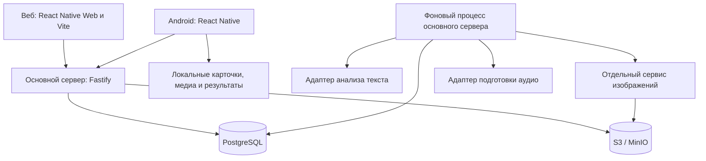

# Архитектура Kompotik

Статус: проект для обсуждения, не описание уже реализованного приложения.
Дата: 23 сентября 2026 года. Версия: 0.1.

## 1. Основания и границы документа

Источники:

- [Функциональные требования](https://docs.google.com/document/d/13DhyOBaIGAJRgvpVTTC32wxpCtCYCFFowQn9RIn3KDU/edit).
- [Нефункциональные требования](https://docs.google.com/document/d/1c5UXA0RfIJ75Z2sQTfz0E-spPfpsIqhiP_baDNj83vI/edit).
- Ответы владельца проекта на вопросы 1–10 от 23 сентября 2026 года. При расхождении они имеют приоритет над документами.

В документе «требование» означает принятое пользователем решение, «предложение» — выбранный здесь вариант для обсуждения. Открытые вопросы перечислены в разделе 15. Схемы данных, API и структура каталогов концептуальные: этот документ не создаёт реализацию и не фиксирует окончательный состав эндпойнтов.

Цель — приложение для автора и друзей, с возможностью последующего публичного доступа. Предлагается простой сервер с бизнес-модулями и отдельными процессами тяжёлой обработки. Масштабирование до большой аудитории не является исходным требованием.

## 2. Принятые требования

| Область | Решение |
| --- | --- |
| Клиенты | Android; веб для телефона и ПК. PWA, iOS и расширение браузера не входят в текущий объём. |
| Языки обучения | Английский → русский и французский → русский. Новые языки добавляются после подготовки контента. |
| Языки интерфейса | Русский, английский и французский; язык интерфейса независим от языка обучения. |
| Обучение | Одна учебная сессия относится к одному иностранному языку. Последовательно можно заниматься разными языками. |
| Карточки | Одна общая карточка представляет конкретный смысл. Она переиспользуется в разных наборах. |
| Редактирование | Пользователь не меняет общие карточки. Может создавать собственные приватные, в том числе для уже существующих смыслов. Правки администратора общей карточки распространяются на всех. |
| Организация | Папка и набор — одна сущность. Есть вложенные папки; карточка может входить в несколько папок. |
| Прогресс | Принадлежит паре «пользователь — карточка», не конкретному набору. |
| Обучение во времени | Требуется интервальное повторение для долгосрочного запоминания. |
| Офлайн | Только обучение по доступным локально карточкам. Создание карточек, генерация картинки и анализ текста требуют сети. |
| Синхронизация | Офлайн-результаты отправляются на сервер после восстановления связи. |
| Упражнения | Прямой перевод с далёкими вариантами, затем с близкими; обратный перевод; аудирование; написание по буквам. Написание можно отключить согласно исходным требованиям. |

Требование «изученные карточки больше не предлагать для изучения» пока неоднозначно относительно повторений. Предложение: исключать их из первичного обучения, но оставлять в интервальных повторениях. Это требует подтверждения; полное исключение из повторений тоже возможно, но меняет смысл долгосрочного обучения.

## 3. Общая схема



Основной сервер владеет пользователями, карточками, папками, прогрессом, учебными сессиями и заданиями на обработку. Это один кодовый проект с модулями, а не отдельный сетевой сервис для каждой сущности.

Сервис изображений отделён согласно нефункциональным требованиям. Он может обращаться к внешнему провайдеру или к локальной модели. Выбор модели пока открыт; наличие отдельного сервиса само по себе не означает аренду GPU.

Анализ текста выполняется в фоновом процессе, чтобы длинная обработка не блокировала HTTP-запросы. На старте это отдельный запуск кода основного сервера. Отдельный сетевой NLP-сервис нужен только при реальной необходимости другого окружения, например Python или GPU, либо независимого масштабирования.

PostgreSQL хранит данные и очередь фоновых заданий. Redis, отдельный брокер сообщений, Kubernetes и поисковый кластер на старте не предлагаются. Усложнять инфраструктуру следует по измеренной необходимости.

## 4. Организация репозитория

Предложение: один TypeScript-монорепозиторий, управляемый workspaces. Конкретный менеджер пакетов фиксируется при создании приложения.

```text
kompotik-app/
  apps/
    web/                  # SPA, Vite 8+, Rolldown, React Native Web
    android/              # React Native; предложение: Expo + Metro
    api/                  # Fastify, бизнес-модули, SQL, запуск worker
    image-service/        # создание изображений, запись в S3
  packages/
    client/               # общие экраны, Reatom-модели, клиентские сценарии
    ui/                   # компоненты, темы, иконки
    learning/             # чистые правила упражнений и планирования повторений
    api-client/           # клиент и типы, генерируемые из OpenAPI
    locales/              # переводы интерфейса
  db/migrations/          # последовательные SQL-миграции
  scripts/                # импорт словарей, подготовка и проверка каталога
  infra/                  # локальное и серверное окружение
  doc/architecture.md
```

Это предлагаемая структура, каталоги ещё не созданы. Общие пакеты выделяются по реальному переиспользованию, а не под каждую функцию. `learning` не зависит от React, Fastify и базы данных. Серверные секреты и SQL не попадают в клиентские пакеты.

Клиентский код группируется по сценариям: account, library, card, learning, import, settings. FSD не используется. Общая логика сочетается с платформенными адаптерами навигации, хранилища, аудио и авторизации. Телефонный и большой экран могут иметь разные композиции компонентов.

## 5. Модель предметной области

### 5.1. Язык, смысл и карточка

`Language` описывает доступный язык. Публикация нового языка требует подготовленного словаря, набора карточек и медиа; произвольного кода языка в настройках недостаточно.

`LexicalEntry` представляет слово или выражение на конкретном языке. `Sense` представляет конкретное значение этой единицы. `Card` представляет учебный материал для этого смысла: русский перевод, определение, примеры, грамматику, изображение и аудио. Разные значения одного слова получают разные `sense_id`. Многословное выражение — самостоятельная лексическая единица.

Предложение: не более одной активной общей карточки на смысл и язык перевода. Приватных карточек может быть несколько. У приватной карточки есть `owner_user_id`; у общей — общая область видимости. Если для нового слова ещё нет словарного смысла, допускается приватная смысловая запись. Пользовательский перевод или смысл не дописывается автоматически в общий словарь.

Прогресс привязан к `card_id`. Поэтому две приватные/общие карточки одного смысла имеют независимый прогресс — это предложение, поскольку пользователь одновременно разрешил собственные дубликаты и задал прогресс по карточке. Автоматически переносить знание между такими карточками без отдельного решения не следует.

Не нужно сливать значения только по одинаковому написанию или русскому переводу. Сопоставление с общим каталогом использует словарные идентификаторы и контекст; неоднозначные результаты требуют выбора пользователя или остаются неподтверждёнными кандидатами.

### 5.2. Основные записи и ограничения

| Запись | Назначение и ограничения |
| --- | --- |
| User, Session | Пользователь, профиль, серверные сессии и устройства. |
| LexicalEntry, Sense | Слова/выражения, значения, ссылки на происхождение словарных данных. |
| Card, CardRevision | Текущая карточка и версии учебного содержимого; язык, смысл, видимость и владелец. |
| MediaAsset | Ключ S3, тип, контрольная сумма, размер, происхождение, статус готовности. |
| Folder | Пользовательская папка-набор с `parent_id`; родитель принадлежит тому же пользователю; циклы запрещены. |
| FolderCard | Связь папки и карточки; уникальная пара `(folder_id, card_id)`. Доступ к приватной карточке проверяется на сервере. |
| CatalogCollection | Редакторская готовая подборка; при добавлении создаёт пользовательскую папку со ссылками на общие карточки. |
| UserCardProgress | Единственная запись `(user_id, card_id)`: состояние обучения, расписание, версия алгоритма, версия прогресса. |
| LearningSession | Язык, выбранные папки, карточки, настройки и версия правил занятия. |
| LearningEvent | Неизменяемое событие результата, идентификаторы устройства/сессии, порядок и версия карточки. |
| ImportJob, ImportCandidate | Задание анализа и найденные смысловые единицы с исходным контекстом до отбора. |
| BackgroundJob | Задание обработки, попытки, срок аренды исполнителем, результат или ошибка. |

Предложение: при обучении папки включать вложенные папки и устранять дубли по `card_id`. Смешанные по языкам папки разрешены, но перед занятием выбирается один язык; все запросы отбора и варианты ответов ограничиваются им.

Статус папки вычисляется по прогрессу её уникальных карточек, включая вложенные папки. Дубли не увеличивают счётчик. Пустая папка имеет отдельное пустое состояние. Добавление неизученной карточки делает ранее завершённую папку незавершённой. Удаление карточки из папки не удаляет прогресс: карточка может остаться в других наборах.

Состав добавленного готового набора предлагается копировать в личную папку, а сами общие карточки переиспользовать. Правки содержимого карточек распространяются всем; изменения состава редакторской подборки автоматически не меняют личные папки. Последнее — отдельное предложение, не подтверждённое требование.

### 5.3. Правки общих карточек

Администратор публикует новую ревизию существующей карточки. Онлайн-клиенты получают её при обновлении данных; офлайн-клиент — при следующей синхронизации. Мгновенно изменить отключённое устройство невозможно.

Исправление опечатки не сбрасывает прогресс. Замена самого смысла должна создавать другую карточку: нельзя незаметно превратить выученную «спину» в «назад». Слияние ошибочных дублей и миграция их прогресса — отдельная административная операция будущего.

Открытая сессия использует снимок ревизии карточки: ответ проверяется по тому заданию, которое пользователь видел. Событие содержит эту ревизию. История версий нужна для проверки запоздалых офлайн-результатов; срок её хранения зависит от поддерживаемого срока офлайн-работы.

## 6. Обучение и интервальные повторения

Предложение для состояния: `new → learning → learned`. Отдельно хранятся параметры расписания: ближайшее повторение, последние результаты, параметры выбранного алгоритма. `learned` означает завершение первичного освоения, а не отсутствие будущих повторений — до подтверждения трактовки из раздела 2.

Режим «новое» выбирает ещё не освоенные карточки, режим «повторение» — карточки с наступившим сроком. Общий запуск может объединять оба потока с настраиваемым лимитом. Выборка всегда относится к одному языку. Переход на другой язык завершает или приостанавливает текущую сессию; сервер не смешивает результаты разных сессий.

Предлагаемый порядок первичного знакомства: просмотр карточки → прямой перевод с далёкими вариантами → прямой перевод с близкими вариантами → обратный перевод → аудирование → написание, если оно включено. Порядок дальнейших упражнений, число успехов и критерии освоения пока не определены. Они задаются версионируемой политикой обучения, а не условием «пять ответов = изучено», придуманным в реализации.

Каждый тип упражнения отделяет формирование задания, проверку ответа и преобразование результата в оценку для планировщика. Правила нормализации написания — регистр, диакритика французского, допустимые формы — необходимо определить отдельно. Историю результатов стоит сохранять по типу упражнения, не вводя пока пять независимых расписаний.

Планировщик имеет узкую функцию: прежнее состояние + результат + время → новое состояние и следующий срок. Конкретный алгоритм интервального повторения выбирается после уточнения критериев; текущая архитектура не требует разрабатывать собственный алгоритм с нуля. Сервер считает итоговое состояние, клиент использует ту же версию правил для локального предварительного результата.

Для прямого перевода неоднозначное слово сопровождается контекстом, чтобы было ясно, какой смысл проверяется. Неверные варианты не должны быть корректными альтернативными переводами. Их подбор выполняется из изучаемого материала с учётом языка и семантической близости. Если в наборе недостаточно подходящих вариантов, предложение — использовать другой доступный тип упражнения; не генерировать двусмысленное задание ради четырёх кнопок. Расширение пула за пределы изучаемого материала требует отдельного решения.

«Я уже знаю» предлагается оформлять отдельным событием, устанавливающим освоение конкретной карточки, а не поддельным успешным ответом. Влияние такой отметки на будущие повторения и возможность отмены ещё не согласованы.

## 7. Офлайн и синхронизация

### 7.1. Android

Предложение: SQLite для карточек, снимков прогресса и очереди событий, файловое хранилище для изображений и аудио. Reatom управляет состоянием интерфейса, но не заменяет постоянное хранилище.

Пользователь заранее скачивает выбранные папки. Учебный пакет содержит карточки и их ревизии, необходимые медиа, данные для вариантов ответа, прогресс и версию правил. Пакет объявляется готовым после проверки всех необходимых файлов. Без аудио задание на аудирование недоступно; отсутствие сети не должно обнаруживаться только после нажатия «воспроизвести».

Локальная запись ответа и добавление события в очередь выполняются одной транзакцией. После перезапуска результаты сохраняются. Синхронизация запускается при открытии/возврате приложения, восстановлении связи и вручную; работа Android в фоне не является единственной гарантией доставки.

### 7.2. Протокол результатов

Клиент отправляет события, а не команду «замени серверный прогресс моим». Минимальные поля: `event_id`, `device_id`, `session_id`, порядковый номер, `card_id`, ревизия карточки, тип/данные результата, время на устройстве, версия учебной политики и исходная версия прогресса.

Сервер извлекает пользователя из авторизации, проверяет доступ и допустимость события. Уникальность `(user_id, event_id)` делает повторную отправку безопасной. Сохранение события, пересчёт прогресса и запись подтверждения выполняются транзакционно с сериализацией изменений одной пары «пользователь — карточка».

В ответе — подтверждения отдельных событий, постоянные ошибки отдельных событий и актуальная версия прогресса. Клиент удаляет из очереди только подтверждённые записи. При сетевой ошибке повторяет отправку с задержкой. Повреждённые или несовместимые события сохраняются для восстановления, а не молча теряются.

Офлайн на двух устройствах всё равно создаёт конфликт расписания, даже без редактирования содержимого. Предложение первой версии: сервер задаёт канонический порядок при приёме событий, сохраняя порядок внутри одной сессии; запоздалые события помечает. Они учитываются в истории, но серия повторений, присланная одним пакетом, не должна искусственно увеличивать интервалы как занятия в разные дни. Правила объединения должны учитывать фактическое время занятия и ограничивать влияние недостоверных часов устройства. Конкретная формула зависит от выбранного планировщика и проверяется до реализации синхронизации.

Это не обещание точного восстановления хронологии между отключёнными устройствами. Возможное расхождение локального расписания исправляется серверным результатом. Альтернатива — пересчёт истории в нормализованном временном порядке; она сложнее и пока не предлагается по умолчанию.

Получение изменений использует серверный курсор с согласованным порядком фиксации, а не только `updated_at` клиентских часов. Удаления передаются как tombstone-записи. Устаревший курсор приводит к полной загрузке доступного состояния, сохраняя неотправленные результаты. Сам механизм журнала изменений фиксируется при реализации; обычная последовательность ID без учёта порядка коммитов недостаточна.

После изменения пароля/истечения сессии требуется повторный вход перед отправкой, результаты остаются локально. Очереди разделены по аккаунтам. Выход из аккаунта с неотправленными результатами требует явного предупреждения; другой пользователь устройства не получает доступ к этим данным.

### 7.3. Веб без PWA

Отказ от PWA не запрещает service worker технически, но его использование нельзя считать уже согласованным. Предложение текущего объёма: веб работает онлайн и сохраняет ответы при кратком обрыве связи в открытом занятии через IndexedDB. Холодный запуск или перезагрузка страницы без сети не гарантируются.

Если требуется полноценное офлайн-обучение в браузере после закрытия вкладки, нужно отдельно согласовать кеширование оболочки и медиа через service worker, даже без установки сайта как приложения. До этого полноценный офлайн гарантируется только Android; это явная граница предлагаемого решения, требующая подтверждения.

## 8. Клиентские технологии

React Native для Android, React Native Web для сайта. Предложение для Android — Expo с Metro; Vite 8+ / Rolldown применяется к вебу, не к нативной сборке. Номера совместимых версий фиксируются lock-файлом после проверки минимальной сборки обеих платформ.

TypeScript strict, Reatom, Zod, React Hook Form, ESLint и Prettier — принятые ограничения. Используется React JSX, без Reatom JSX. Перед реализацией состояния требуется прочитать агентскую документацию выбранной версии Reatom; не смешивать примеры разных основных версий.

Типы сетевых DTO и клиент генерируются из OpenAPI. Zod применяется к формам, локальным данным и серверным границам. Доменная модель не экспортируется целиком как сетевой ответ.

Темы, локализация, скелетоны, обработка ошибок, анимации и клавиатурные сокращения оформляются общими средствами UI. Навигация и тяжёлые экраны загружаются лениво там, где это поддерживает соответствующая платформа; веб разбивается на чанки. Error Boundary дополняет обработку сетевых ошибок, а не заменяет её.

Иконки имеют общий интерфейс `<Icon name="search" />` и типизированный реестр. Для веба — SVG-компоненты через vite-plugin-svgr и `currentColor`. Для Android нужен отдельный совместимый SVG-адаптер/генерация под нативный рендерер: Vite-плагин не обрабатывает Metro. Цвет передаётся из общей темы. Платформенную совместимость иконок проверяем прототипом до создания большого набора компонентов.

Формальная программа доступности отложена согласно исходным требованиям; текущий проект не добавляет её как отдельный этап.

## 9. Сервер, SQL и API

Бизнес-модули основного сервера: identity, catalog, library, learning, imports, media, jobs. Внутри модуля рядом находятся маршруты, схемы, сценарии и SQL-репозитории. Взаимодействие модулей — через явно названные функции сценариев; прямое чтение чужих таблиц не становится обычным интерфейсом.

SQL пишется вручную, с параметрами. Внешние функции работают с предметными объектами и интерфейсами репозиториев, а не с драйвером PostgreSQL. Транзакция передаётся через узкий контекст. Это изолирует SQL, но не обещает бесплатной замены СУБД: блокировки, миграции и очередь всё равно используют свойства PostgreSQL. ORM и query builder не вводятся.

Один ограниченный пул соединений на процесс. Суммарный лимит API и worker оставляет запас для миграций и администрирования. Внешние вызовы AI не держат транзакции и соединения. Лимиты запросов, время ожидания блокировок и размеры пулов задаются конфигурацией и проверяются под ожидаемой нагрузкой.

SQL-миграции нумеруются, имеют контрольные суммы и выполняются одним исполнителем с блокировкой. Применённые файлы не переписываются. Сначала добавляются совместимые поля, затем выкатывается код, позже убираются старые. Большие backfill-операции идут отдельно от коротких миграций. Откат приложения не означает автоматический разрушительный откат данных.

HTTP API имеет префикс `/api/v1`. Примеры групп: `/auth`, `/languages`, `/cards`, `/folders`, `/learning/sessions`, `/learning/events`, `/sync`, `/imports`, `/jobs`. Ответ создания фонового задания — `202` и ID задания; результат запрашивается отдельно. WebSocket для первой версии не требуется.

Источник OpenAPI — схемы входа и выхода рядом с маршрутами. Fastify имеет собственные механизмы валидации и сериализации; подключение Zod требует согласованного адаптера. До массового написания API проверяем цепочку Zod → OpenAPI → генерация клиента и совместимость сериализации. CI проверяет актуальность сгенерированного контракта.

Общий формат ошибки: `{ code, message, details, requestId }`. `code` стабилен и не зависит от языка; `details` типизированы для конкретного кода и не содержат секретов. Сообщение локализуется клиентом. Ошибка не служит контейнером успешного результата. Общие коды описываются в коде и OpenAPI.

Списки: `limit`, непрозрачный `cursor`, фиксированный перечень фильтров и сортировок. Стабильная сортировка имеет дополнительный ключ ID. Имена SQL-полей не принимаются напрямую от клиента. Все даты событий хранятся как временные отметки UTC; пользовательский часовой пояс — отдельное поле профиля для отображения и будущих дневных правил.

Отмена чтения через AbortSignal прекращает ненужное ожидание и по возможности серверную работу. Для фоновой генерации нужна отдельная команда отмены задания. Разрыв HTTP-соединения сам по себе не отменяет уже принятую генерацию и не откатывает совершённую запись.

## 10. Импорт, подготовка языков и медиа

Подготовка языка — повторяемый административный процесс: загрузка словарных данных → нормализация слов и смыслов → проверка и сопоставление → создание общих карточек и подборок → подготовка изображений и аудио → публикация каталога. Хранятся источник, версия набора данных и необходимые сведения об атрибуции. Конкретные лицензии и условия источников нужно проверить перед распространением контента.

Пользовательский импорт: отправить материал → получить задание → извлечь слова/выражения и контекст → сопоставить смыслы → показать кандидатов → отобрать материал → создать папку и связи с карточками. Общие готовые карточки переиспользуются. Отсутствующие создаются как приватные. Импорт не делает пользовательские тексты частью общего каталога.

Форматы источников, максимальные размеры, качество определения смыслов и провайдеры пока не согласованы. Поэтому первая реализация парсеров должна иметь ограниченный явно объявленный набор форматов, а не обещать обработку любых книг, ссылок и видео. Извлечение текста, анализ и сопоставление смыслов имеют отдельные интерфейсы и версии результатов.

Создание пользовательской карточки проходит состояния `draft → generating → ready` либо `failed`. Генерация картинки обязательна по ответу пользователя; карточка становится доступна для обучения после подготовки обязательного содержимого. Черновик сохраняется при ошибке, повтор не создаёт дубликат. Требуемость аудио для публикации ещё открыта.

Очередь имеет состояния pending/running/succeeded/failed/cancelled. Исполнитель получает задание на ограниченное время, продлевает аренду, повторяет только временные ошибки с лимитом попыток. Результат фиксируется условно по актуальному идентификатору попытки, чтобы опоздавший исполнитель не перезаписал новый результат. API создаёт предметную запись и задание одной транзакцией.

Сервис изображений принимает устойчивый ID операции и параметры, записывает результат в S3, возвращает метаданные. Повтор запроса возвращает существующий результат. Перед повтором после тайм-аута проверяется состояние операции. Внешний провайдер может не обеспечивать идемпотентность: повторное списание полностью исключить нельзя, поэтому нужны учёт попыток и лимиты.

S3 хранит файлы, PostgreSQL — их метаданные и принадлежность. Новая версия файла получает новый ключ; старый файл не перезаписывается по тому же адресу. Общие и приватные медиа имеют разные правила доступа. Приватные файлы выдаются после проверки прав, через краткоживущие ссылки или сервер. Скачанная офлайн-копия привязана к аккаунту на устройстве.

Незавершённые загрузки и файлы без ссылок очищаются отложенно, после защитного периода. Удаление папки не удаляет общие медиа. MinIO соответствует исходному требованию; совместимую версию, лицензию и способ сопровождения нужно проверить при подготовке окружения.

## 11. Авторизация и границы доступа

Регистрация — email и пароль. Предложение: хеширование паролей современной специализированной библиотекой, ограничение попыток входа, одноразовые ограниченные по времени токены восстановления. Подтверждение почты и удаление аккаунта требуют уточнения продуктового сценария.

Веб: серверная сессия в Secure/httpOnly cookie; same-site размещение веба и API упрощает настройки. Для изменяющих запросов предусмотрены защита от CSRF и проверка origin. Токены авторизации не хранятся в localStorage.

Android: короткоживущий access token и обновляемый refresh token с серверным отзывом сессии. Refresh token хранится в защищённом системном хранилище. Конкретная библиотека выбирается при реализации; собственные криптографические протоколы не создаются.

Каждая операция проверяет доступ к папке, приватной карточке и заданию. Предсказуемость или случайность ID не заменяет проверку. Сервис генерации недоступен напрямую из клиентского приложения; у него отдельные ограниченные полномочия к хранилищу. Ключи внешних AI-провайдеров находятся только на сервере.

Публичные провайдеры входа и публикация приватных карточек администратором отложены. Для начального наполнения предлагаются административные скрипты; полноценная админ-панель не включается без отдельной необходимости.

## 12. Развёртывание и эксплуатация

Предложение для начала: один Linux-сервер с reverse proxy/TLS, статическим вебом, API, worker, сервисом изображений, PostgreSQL и MinIO. Все процессы могут находиться на одной машине, если генерация использует внешний сервис. Это экономичный вариант с единой точкой отказа, не схема высокой доступности.

Для разработки — воспроизводимое окружение зависимостей, например Docker Compose, и команды запуска приложений. README должен описывать Windows и Linux, переменные окружения, миграции, начальное наполнение и сборку Android. Секреты и пользовательские данные не коммитятся; `doc` является обычной версионируемой частью проекта.

Структурированные серверные логи содержат request/job ID, длительность, код ошибки и безопасные технические поля. Пароли, токены и полные исходные тексты в логи не попадают. Минимальные метрики: задержки API, ошибки, очередь и её возраст, пул БД, память, объём медиа и расходы на генерацию.

Liveness проверяет работоспособность процесса; readiness — возможность обслуживать его роль. Недоступность генератора должна останавливать новые генерации, но не чтение карточек и обучение. При graceful shutdown сервер прекращает приём новой работы, завершает короткие запросы, worker освобождает/теряет аренду задания, соединения закрываются.

Резервные копии PostgreSQL и S3 хранятся отдельно от основного сервера. Периодически проверяется восстановление связанных записей и файлов. Допустимая потеря данных и время восстановления ещё не заданы; ежедневная копия сама по себе не означает приемлемую надёжность.

## 13. Обновления и совместимость

Веб публикует файлы с хешами и обновляемый HTML; старые чанки сохраняются на переходный период для открытых вкладок. Service worker не добавляется до решения по веб-офлайну. Web Worker и Service Worker — разные механизмы; исходное требование об обновлении кеша нужно применять к реально выбранному механизму.

Android обновляется независимо от сервера. `/api/v1` развивается совместимыми добавлениями; удаление полей и изменение смысла требуют нового контракта. Срок поддержки старых клиентов, максимальное время офлайн и способ распространения Android пока открыты.

Версия приложения, версия API, версия карточки и версия алгоритма обучения независимы. Сервер сообщает минимальную поддерживаемую версию. При устаревшем клиенте нельзя стирать очередь результатов: нужны совместимый приём старых событий либо явный путь восстановления. Миграции локальной базы сохраняют неотправленные события.

## 14. Проверки и стоимость

До основной разработки нужны небольшие технические проверки: общие React Native-компоненты в Vite и Android; Reatom с React без собственного JSX; нативные SVG; генерация OpenAPI; локальная транзакция ответа и восстановление после перезапуска.

Основные автоматические проверки ориентированы на риски: отсутствие повторного начисления прогресса при повторной отправке, независимость прогресса от папок, изоляция приватных карточек, смешанные языки, дубли в дереве, поздние события двух устройств, обучение по старой ревизии, сбой worker после записи файла и до фиксации результата, миграции БД. Сквозной сценарий: скачать набор → пройти офлайн → перезапустить приложение → восстановить сеть → увидеть единый прогресс в вебе.

Конкретные денежные оценки пока невозможны: нет провайдеров, объёмов каталога и пользовательских лимитов. Основные потенциальные расходы:

| Источник | Риск и способ ограничения |
| --- | --- |
| Изображения | Генерация тысячи новых смыслов может стать главным начальным расходом. Переиспользовать общие карточки, генерировать партиями после оценки цены, ограничивать приватные генерации. |
| Анализ книг | Цена растёт с объёмом и повторными попытками. Лимитировать размер, число одновременных заданий и повторные обработки. |
| Аудио | Сохранять подготовленный результат; не синтезировать при каждом прослушивании. |
| Хранение и трафик | Изображения, звук и офлайн-загрузки растут быстрее текстовых данных. Учитывать размер файлов и объём скачиваний. |
| Собственный GPU | Постоянно включённая машина может быть невыгодна для небольшой аудитории. Выбирать после сравнения нагрузки и стоимости, а не из-за наличия image-service. |
| Публичный доступ | Бесплатная неограниченная генерация позволяет быстро исчерпать бюджет. До открытия регистрации нужны лимиты на пользователя и общий предел расходов. |

Модель оценки: новые картинки × стоимость картинки + объём анализа × тариф + озвучка + сервер + хранение/трафик + резервные копии. Перед массовой подготовкой языка нужен небольшой измеренный образец и экстраполяция. Предлагается жёсткий общий лимит расходов на задания и возможность остановить генерации, сохранив обучение по готовым карточкам.

## 15. Что согласовать после чтения

В первую очередь:

1. Оставляем ли изученные карточки в интервальных повторениях и как ведёт себя «Я уже знаю»?
2. Подтверждается ли полноценный офлайн только в Android, а в вебе — сохранение ответов при обрыве открытого занятия? Если нет, нужно уточнить браузерный офлайн без установки PWA.
3. Независим ли прогресс приватной карточки от общей карточки того же смысла?
4. Подтверждается ли обучение по вложенным папкам и фильтрация языка в смешанной папке?
5. Когда карточка считается освоенной, как отключение написания влияет на завершение и как нормализуются ответы?

До реализации соответствующих частей:

- Форматы и максимальный размер источников; допустимые ошибки анализа; необходимость ручной коррекции кандидатов.
- Провайдеры анализа/изображений/аудио и допустимость отправки им пользовательских материалов.
- Обязательность аудио до готовности карточки, лимиты генераций и ориентир бюджета.
- Срок хранения исходных материалов, старых ревизий и истории результатов.
- Срок поддержки Android-клиентов и офлайн-пакетов; критерии обработки поздних/пересекающихся занятий.
- Готовые подборки и условия использования словарных данных; обновление состава уже добавленных подборок.
- Регистрация, подтверждение почты, восстановление, экспорт и удаление аккаунта; страны запуска и размещения.
- Уведомления, дневные цели и правила часового пояса, если эти функции входят в релиз.
- Целевые задержки, допустимый простой и потеря данных, размещение и способ распространения Android.

Не все вопросы блокируют описание архитектуры, но документ не превращает отсутствующие ответы в окончательные требования.

## 16. Предлагаемый порядок реализации

1. Согласовать ключевые вопросы из раздела 15 и проверить совместимость клиентского стека.
2. Создать каркас, контракты, миграции и авторизацию; загрузить небольшой проверенный общий каталог.
3. Реализовать папки и единый пользовательский прогресс, затем онлайн-занятие на одном языке.
4. Зафиксировать учебные правила; добавить локальное хранение Android, очередь событий и серверное объединение результатов.
5. Добавить приватные карточки, отдельный сервис изображений и фоновые задания с лимитами.
6. Добавить анализ пользовательских текстов, подготовку второго языка и готовых наборов.
7. Проверить обновления, восстановление резервных копий и ограничения перед открытым доступом.

Оба языка входят в целевой объём: их последовательное подключение здесь — порядок разработки, а не исключение французского из релиза.

## 17. Технические источники

Проверены при подготовке документа; версии зависимостей требуется отдельно зафиксировать при реализации.

- [Fastify: Validation and Serialization](https://fastify.dev/docs/latest/Reference/Validation-and-Serialization/) — границы валидации и сериализации, адаптация схем.
- [Vite: Features](https://vite.dev/guide/features) — веб-сборка и Web Workers.
- [Reatom: официальный репозиторий](https://github.com/reatom/reatom) — точка входа к документации выбранной версии.
- [Expo: SQLite](https://docs.expo.dev/versions/v55.0.0/sdk/sqlite/) — локальное хранилище; веб-поддержка имеет отдельные условия и не должна предполагаться автоматически.
- [Expo: хранение данных](https://docs.expo.dev/develop/user-interface/store-data/) — локальные данные и защищённое хранилище.
- [MDN: Using Service Workers](https://developer.mozilla.org/en-US/docs/Web/API/Service_Worker_API/Using_Service_Workers) — кеширование для офлайн-запуска сайта.
