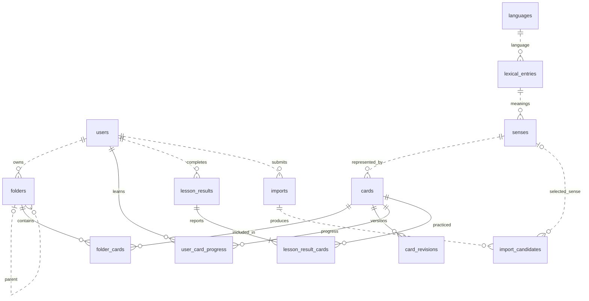
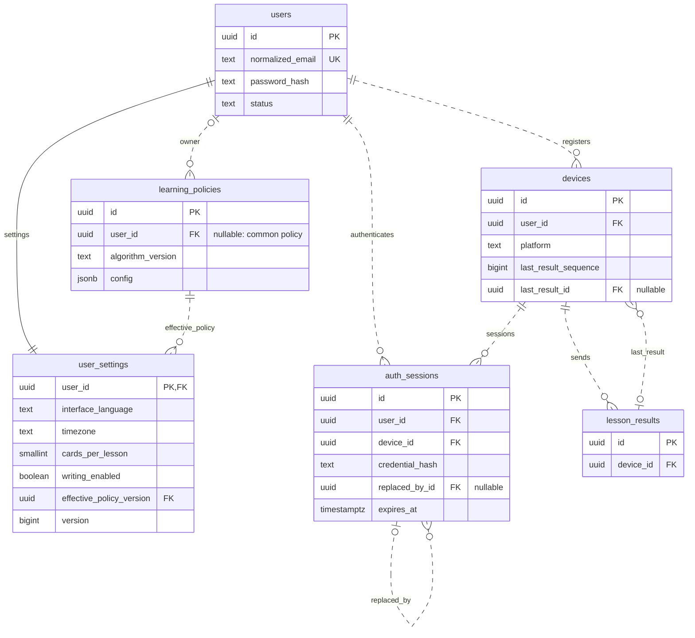
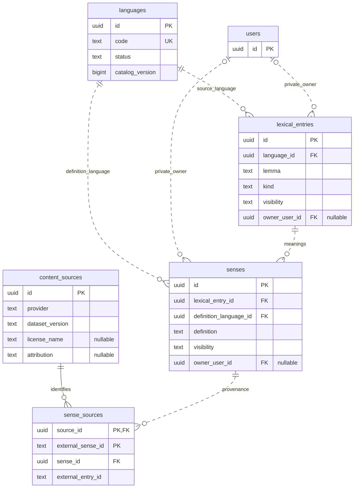
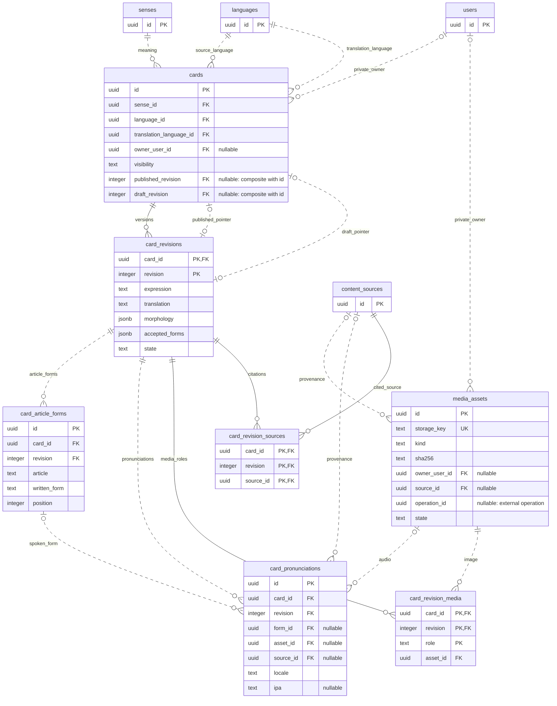
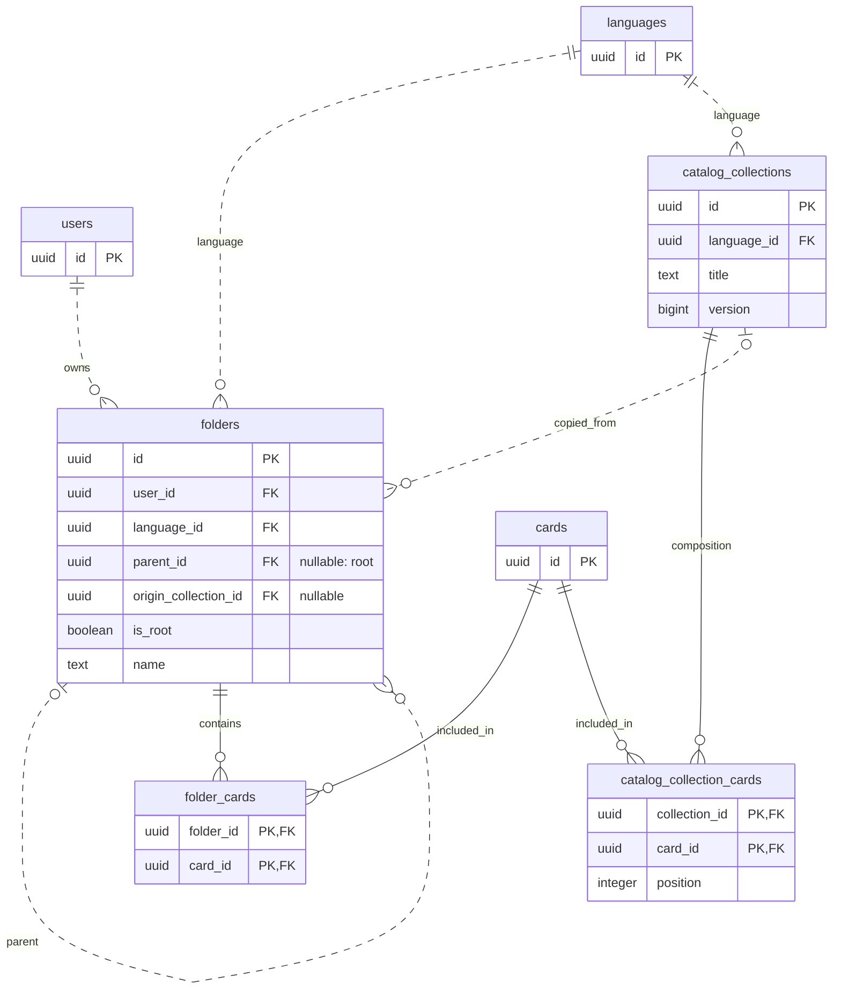
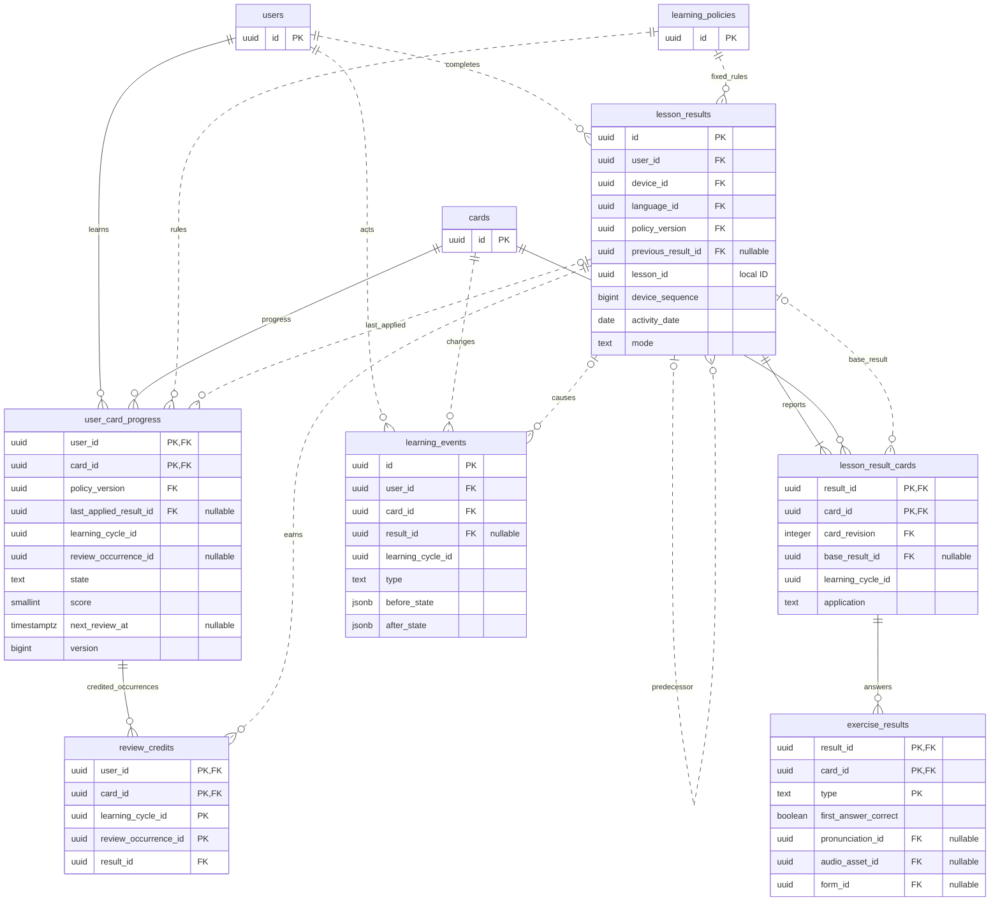
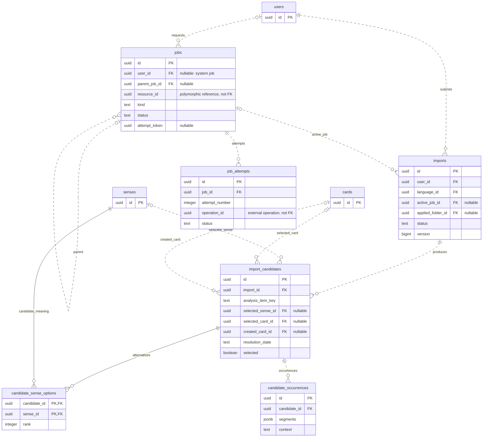
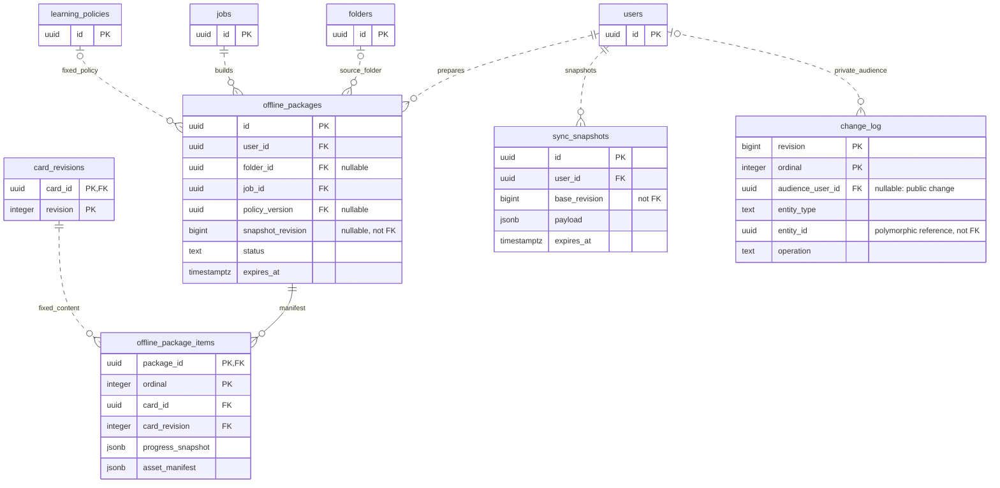
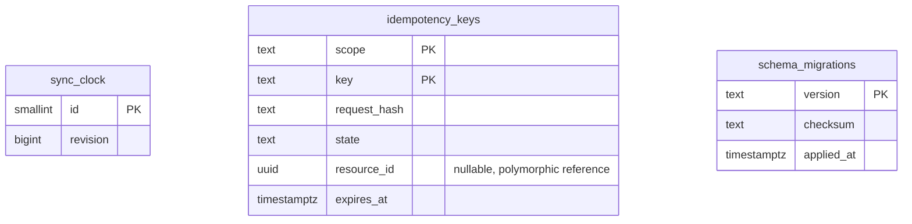

# ER-диаграмма базы Kompotik

Статус: визуализация [проекта схемы БД](database.md), не реализованная схема. Дата: 25 сентября 2026 года.

Ниже — общий вид и отдельные диаграммы по областям. Разделение позволяет читать связи без одной огромной схемы. Таблицы, повторённые в разных диаграммах, обозначают одну и ту же сущность. Показаны ключи и основные предметные поля; полный перечень полей и ограничений находится в [описании БД](database.md).

Диаграммы записаны в Mermaid и отображаются в Markdown-просмотрщиках с его поддержкой.

## Обозначения

- `PK` — первичный ключ; несколько PK-полей образуют один составной ключ.
- `FK` — внешний ключ; несколько полей могут образовывать один составной FK.
- `UK` — уникальное поле. Составные и условные ограничения уникальности описаны текстом под схемой.
- `||` — ровно один; `o|` / `|o` — ноль или один; `o{` / `}o` — ноль или много; `|{` / `}|` — один или много.
- Сплошная линия — идентифицирующая связь: ключ родителя входит в PK дочерней записи. Пунктир — остальные FK-связи. Пунктир не означает отсутствие ограничения БД.
- Комментарий `nullable` означает необязательное поле. Обязательность связей показана также символами у концов линий.

## 1. Общий вид предметной области

Связь папок и карточек — многие ко многим через `folder_cards`. Прогресс относится к паре пользователь/карточка, а не к папке. Один смысл может иметь общую и несколько приватных карточек. Общая схема намеренно опускает медиа, авторизацию и технические таблицы — они раскрыты ниже.

## 2. Пользователи, устройства и настройки

Одна запись настроек на пользователя создаётся при регистрации. FK сам по себе не гарантирует существование настроек у каждого пользователя — это инвариант команды регистрации. `auth_sessions` — сессии авторизации, не занятий. Ссылка на последний отчёт устройства не делает его владельцем отчёта: согласованность пользователя/устройства проверяется отдельно. Кардинальность самоссылки сессий отражает только описанный FK; правила единственного преемника при ротации проверяются командой авторизации.

## 3. Словарь и источники

Одинаковое написание не является уникальным ключом лексической единицы. Стабильный внешний ID смысла уникален в пределах источника, а не всего приложения. Приватный владелец nullable только для общего контента; общая запись не может зависеть от приватной словарной записи.

## 4. Карточки, ревизии и медиа

FK ревизии — пара `(card_id, revision)`, а не отдельная ссылка на номер revision. Указатели карточки используют пары `(id, published_revision)` и `(id, draft_revision)`, поэтому указывают только на собственные версии. Одна ревизия может быть текущей опубликованной/черновой максимум у своей карточки.

У общей неархивной карточки уникальна пара `(sense_id, translation_language_id)`. Для приватных карточек такого ограничения нет. Порядок формы уникален в пределах ревизии; default-произношение ограничено одним на каждую форму ревизии, включая основную форму с `form_id=null`. Готовое аудио переиспользуется, но новое содержимое файла получает новый `media_assets.id` и ключ.

## 5. Папки и готовые подборки

Для корней уникальна пара `(user_id, language_id)`. Проверка дерева запрещает циклы и родителя другого владельца/языка. Связь `copied_from` сохраняет происхождение, но не означает синхронизацию состава личной папки с подборкой. Удаление связи из папки не удаляет карточку или её прогресс.

## 6. Прогресс и история обучения

Чтобы не перегружать схему, следующие межобластные FK перечислены отдельно:

| Дочерняя запись | Ссылка | Обязательность |
| --- | --- | --- |
| `lesson_results` | `device_id → devices.id`, `language_id → languages.id` | Обязательные. |
| `lesson_result_cards` | `(card_id, card_revision) → card_revisions.(card_id, revision)` | Обязательная пара. |
| `exercise_results` | `pronunciation_id → card_pronunciations.id`, `audio_asset_id → media_assets.id`, `form_id → card_article_forms.id` | Nullable; наличие зависит от упражнения. |

Уникальны `(user_id, lesson_id)` и `(user_id, device_id, device_sequence)`. PK `review_credits` не позволяет дважды зачесть один срок в одном цикле. Поля `learning_cycle_id`, `review_occurrence_id` и локальный `lesson_id` не являются FK на скрытые таблицы сессий. Для новой карточки строка прогресса может отсутствовать — API возвращает виртуальное начальное состояние.

Минимум одна карточка в принятом уроке — инвариант приёма отчёта. Наличие/количество упражнений проверяется по плану и политике; ER-связь допускает пустой набор, но не объявляет его успешным результатом.

## 7. Импорт и фоновые задания

Межобластные FK: `imports.language_id → languages.id` обязателен; `imports.applied_folder_id → folders.id` nullable. Уникальны `(import_id, analysis_item_key)` и `(job_id, attempt_number)`. Выбранный смысл и созданная карточка появляются по мере разрешения кандидата; они не обязательны при первом результате анализа.

`jobs.resource_id` — полиморфная предметная ссылка, а `operation_id` — ID операции специализированного сервиса. FK-линии к ним намеренно не нарисованы. Реестр операций отдельного сервиса описан в [контрактах сервисов](service-interfaces.md), он не является частью предметной схемы основного приложения.

## 8. Офлайн-пакеты и синхронизация

Дополнительно `offline_package_items.card_id → cards.id`; пара `(card_id, card_revision)` ссылается на ревизию. Пара `(package_id, card_id)` уникальна. Пакет может быть пустым или ещё строиться, поэтому нижняя граница элементов — ноль. `jobs → offline_packages` показывает кардинальность описанного FK: ограничение UNIQUE на job_id в проекте БД пока не задано.

Номера `base_revision` и `snapshot_revision` — границы снимков, не ссылки на существующую строку журнала. В `change_log.entity_id` может находиться ID уже удалённого объекта: обычный FK мешал бы хранить tombstone.

## 9. Независимые технические таблицы

`sync_clock` — одна изменяемая строка счётчика, а не родитель всех записей журнала. `idempotency_keys.scope` кодирует область запроса, но не является FK на пользователя. Эти таблицы не соединяются фиктивными отношениями только ради общего рисунка.

## Границы диаграммы

Схема охватывает серверные таблицы из разделов 2–9 [описания БД](database.md). Локальные кеши SQLite/IndexedDB, S3-файлы и технический реестр внешних сервисов не являются таблицами этой PostgreSQL-схемы.

ER-диаграмма не выражает проверки прав, одинакового языка, отсутствия циклов, допустимых переходов статусов и порядка транзакций. Эти правила, а также nullable-поля, не показанные среди сокращённого набора атрибутов, остаются в описании БД. Новые сущности или продуктовые правила этим документом не вводятся.
